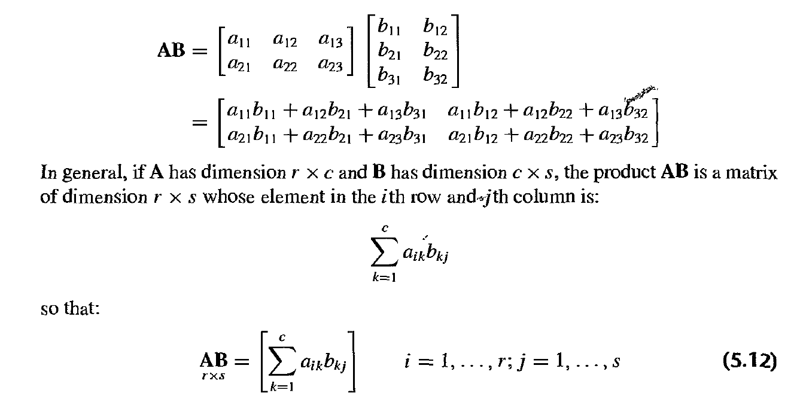
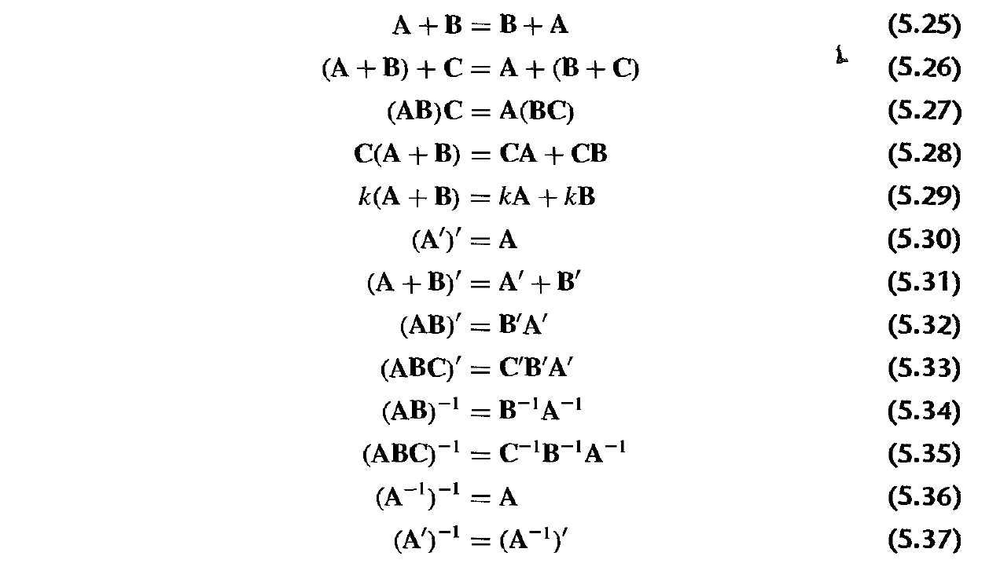
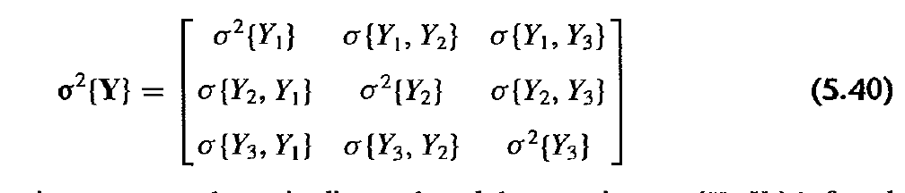
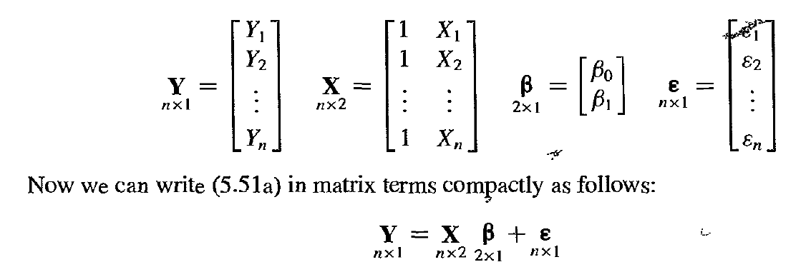

```{r setup, include=FALSE}
knitr::opts_chunk$set(echo = TRUE)
knitr::opts_chunk$set(fig.align = 'center')
library(palmerpenguins)
library(dplyr)
library(ggplot2)
library(gridExtra)
library(printr)

theme_set(theme_minimal()) # automatically set a simpler ggplot2 theme for all graphics
peng <- penguins %>% 
  filter(complete.cases(.))
```

## Review of Homework 1

- The plot was not useful because of overplotting - it's ok to have a plot that does not show any relationship. Sometimes no relationship is as meaningful as a relationship
- The plot is not useful because it is not adequately showing the data. 
_ All the points were stacked on top of each other because there were two sets of categorical variables on each side of the axis. So you couldn't actual tell how many points fell into each one of the intersections
- One way to help this setting an alpha level to make it darker for the number of points are there

# Parameter Accuracy

## Where we are:

```{r echo=TRUE}
mod <- lm(flipper_length_mm ~ body_mass_g, data = peng)
beta0 <- coef(mod)[1]
beta1 <- coef(mod)[2]
sigma <- summary(mod)$sigma
```


$$
Y = \beta_0 + \beta_1X
$$


$$
\begin{aligned}
\hat\beta_0 &= \bar{Y} - \hat\beta_1\bar{X} \\
\hat\beta_1 &= \frac{\sum{(X_i - \bar{X})(Y_i - \bar{Y})}}{\sum{(X_i - \bar{X})^2}} \\
\hat{\sigma}^2 &= \frac{\sum{(Y_i - \hat{Y_i})^2}}{n-2}
\end{aligned}
$$

## How confident are we in these values?

- Difference between saying that $beta_1$ is .015 from it's between -1 and 1 but my guess is .015.

## Sampling Distribution of $\hat\beta_1$ 

$$
E\{\beta_1\} = \hat{\beta_1} \\
\sigma^2\{\beta_1\} = \frac{\hat\sigma^2}{\sum{(X_i - \bar{X})^2}}
$$
- Where we use the unbiased estimate of $\sigma^2$ from before.

```{r, echo = TRUE}
sigma_beta_1 <- sqrt(sigma^2/sum((peng$body_mass_g - mean(peng$body_mass_g))^2))
```

- The normality of the sampling distribution of $\hat\beta_1$ follows from the fact that $\hat\beta_1$ is a linear combination of $Y_i$

What happens when we get more data?

- We can get more accurate estimates of $beta_1$, aka we can make the second equation smaller, by growing the denominator. You can do this by increasing the number of X values (growing the data), the distance between each X value and the mean, or minimize the numerator by improving your model.

## Standardized sample distribution for $\hat\beta_1$

- The standardized distribution follows a t distribution with n-2 degrees of freedom
- The reason why it’s a t distribution as opposed to other distributions is because we have to estimate the parameter $\hat\sigma^2$. If we know this value, then the equal

$$
\frac{\hat\beta_1 - E\{\hat\beta_1\}}{\hat\sigma^2\{\hat\beta_1\}} \sim t(n-2) 
$$

- $t$ distribution is necessary because we are estimating the variance in denominator
- The difference a t distribution and a standard normal distribution (mean zero) is that the t one has slightly fatter tails, meaning that the outside of the t distribution has a little more weight out there in the tails then a normal.
- This is because we have to estimate the $\hat\sigma^2$, we have to allow the parameter to be a little more spread out. 
- When the degrees of freedom go up, it gets more normal. The more data we have the distribution becomes closer and closer to a reg old standard normal distribution.

## Creating confidence intervals for $\hat\beta_1$

set $\alpha = .95$

$$
\hat\beta_1 + \hat\sigma * t(\frac{1-\alpha}{2}, n - 2) \\
\hat\beta_1 + \hat\sigma * t(\frac{1+\alpha}{2}, n - 2)
$$

- We're finding the upper and lower values of that t- distribution

```{r, echo=TRUE, out.width= "50%"}
# t- distribution
p1 <- tibble(prob = seq(0,1, length.out = 1000),
       quantile = qt(prob, df = 30)) %>% 
  ggplot(aes(x = prob, y = quantile)) +
  geom_line()

# t chart for values
p2 <- tibble(quantile = seq(-3, 3, length.out = 100),
       density = dt(quantile, df = 30)) %>% 
  ggplot(aes(x = quantile, y = density)) +
  geom_line()

grid.arrange(p2, p1, ncol =2)
```

- The quantile graph has to have the degree of freedom built into it

## Example with $\beta_1$

- The qt part of the code below is the quantile for t

```{r, echo = TRUE}
low_95_ci <- beta1 + sigma_beta_1*qt(.025, df = nrow(peng) - 2)
high_95_ci <- beta1 + sigma_beta_1*qt(.975, df = nrow(peng) - 2)
```

```{r echo=TRUE}
sim_beta_1_data <- data.frame(x = seq(-3, 3, length.out = 100))
sim_beta_1_data <- sim_beta_1_data %>% 
  mutate(y = beta1 + sigma_beta_1*dt(x, df = nrow(peng) - 2))

ggplot(sim_beta_1_data, aes(x = (x*sigma_beta_1 + beta1),
                            y = y)) +
  geom_line() +
  labs(x = "beta_1",y = "density") +
  scale_x_continuous(breaks = unname(c(low_95_ci, high_95_ci, beta1)))
```

- This graph shows the t distribution of our beta. the middle value is our estimate, the right and left values are the 95% confidence interval. meaning that 95% of the probability is between the right value and left value

## Interpretation of confidence interval

- It is not:
    - The true value of $\beta_1$  has a 95% chance of falling between the low and high value

- More accurate:
    - If you repeat the experiment, you expect that 95% of the CIs contain the true value of $beta_1$
 
Is it wrong to say there is a 30% chance it'll rain? 

- No, because that's actual a point estimate about binomial distribution. You're point estimate defines the variation, because your point estimate is 30% but that also defines the variation

## Sampling Distribution of $\hat\beta_0$

$$
E\{\beta_0\} = \hat{\beta_0} \\
\sigma^2\{\beta_0\} = \hat\sigma^2  \left[\frac{1}{n} +  \frac{\bar{X}^2}{\sum{(X_i - \bar{X})^2}} \right]
$$

```{r, echo = TRUE}
sigma_beta_0 <- sqrt(sigma^2*(1/nrow(peng) + mean(peng$body_mass_g)^2/
                                sum((peng$body_mass_g - mean(peng$body_mass_g))^2)))
```

## Sampling Distribution Around $\hat{Y}$ 

$$
E\{\hat{Y}_h\} = \hat{\beta_0} + \hat\beta_1X_h \\
\sigma^2\{\hat{Y}_h\} = \hat\sigma^2  \left[\frac{1}{n} +  \frac{(X_h - \bar{X})^2}{\sum{(X_i - \bar{X})^2}} \right]
$$

- Let's say you want to estimate the mean of a bunch of penguins that are 3000kg in weight. You use the first equation
- The second equation is the standard error around it.

What happens when X_h = 0?

- All the other previous values were sort of model based so the standard error for beta is consistent no matter what section of the data you're looking at

What happens when we are far from $\bar{X}$?

- However you're standard error is going to be different depending on your X is. So what we're doing is we're saying for X_h, what's the standard error? And so the further you are from the mean the larger standard error. If you are far away the mean, presumably you are further away from a lot of the data you are looking at and therefore you’ll have a higher standard error

## Distribution for $\hat{Y}$

```{r, echo=TRUE}
# The distribution for predictions
peng_out <- peng %>% select(body_mass_g, flipper_length_mm)
peng_out <- bind_cols(
  peng_out,
  as.data.frame(predict.lm(mod, interval = "confidence"))
) %>% rename(conf_low = lwr, conf_high = upr)

ggplot(peng_out, aes(x = body_mass_g, y = flipper_length_mm)) +
  geom_point(aes(color = "observed data")) +
  geom_line(aes(y = fit, color = "confidence"), ) + 
  geom_ribbon(aes(ymin= conf_low, ymax = conf_high, fill = "confidence"), alpha = 0.3) + 
  scale_color_manual(values = c("observed data" =  "#9ebcda",
                                "confidence" = "#fb9a99")) +
  labs(color = "")
```

- What it's showing is that this is the distribution for the mean response, for the infinity of penguin the mean would fall in the red. that's useful for the slope of the line or the line itself, but not useful for a single penguin confidence interval for flipper length.
- It's thinner in the center of the data than on the ends of it. The confidence interval feels a little thin throughout.

## Sampling Distribution around new observation (prediction)

$$
E\{\hat{Y}_{new}\} = \hat{\beta_0} + \hat\beta_1X_h \\
\sigma^2\{\hat{Y}_{new}\} = \hat\sigma^2  \left[1 + \frac{1}{n} +  \frac{(X_h - \bar{X})^2}{\sum{(X_i - \bar{X})^2}} \right]
$$

- The second equation is the equation for the standard error for a single random penguin you might run into. What were basically doing it we're adding the MSE to the entire equation with adding 1

## Sampling Distribution around new observation (prediction)

- if you have $m$ new observations at a given $X_h$

$$
\sigma^2\{\hat{Y}_{new_m}\} = \hat\sigma^2  \left[\frac{1}{m} + \frac{1}{n} +  \frac{(X_h - \bar{X})^2}{\sum{(X_i - \bar{X})^2}} \right]
$$

```{r, echo=TRUE, warning=FALSE, out.width="60%"}
peng_out <- bind_cols(
  peng_out,
  as.data.frame(predict.lm(mod, interval = "prediction")) %>% select(-fit)
) %>% rename(pred_low = lwr, pred_high = upr)

ggplot(peng_out, aes(x = body_mass_g, y = flipper_length_mm)) +
  geom_point(aes(color = "observed data")) +
  geom_ribbon(aes(ymin= pred_low, ymax = pred_high, fill = "prediction"), alpha = 0.3) +
  geom_ribbon(aes(ymin= conf_low, ymax = conf_high, fill = "confidence"), alpha = 0.3) + 
  geom_line(aes(y = fit, color = "confidence"), ) + 
  scale_color_manual(values = c("observed data" =  "#9ebcda",
                                "confidence" = "#fb9a99")) +
  labs(color = "")
```

- This blue shaded line shows the prediction interval for a penguin of a given body mass. 
- It's important to keep in mind that you aren’t overly confident with what the flipper length of a penguin will be when you just met one
- What happens when you observation 5 penguins that are all 5kg. That one is divided by the observation you're making. If m was one, you get the previous eq and when you observation an infinite number of penguins that becomes zero and you get the eq for the mean

# Hypothesis Test

## Setup 

- We often wish to determine the significance of a variable or multiple variables. We must create a null hypothesis and an alternative hypothesis to test

$$
H_0: \beta_1 = 0 \\
H_a: \beta_1 \neq 0
$$

- The null hypothesis is $\beta_1=0$, which means that there is no relationship between body mass and flipper length. However this hypothesis is really unlikely that it is true but yet we still use it as a null hypothesis. No one actual believes that it is true and it won’t be given enough data 
- The alt hypothesis is that there is a relationship between the body mass and flipper length
- The null and alt are mutually exclusive

We set an alpha level which is the probability of rejecting the null hypothesis given that it's true. Columns show what is true:

|Study Says| $H_0$| $H_a$|
|----------|------|------|
|No effect  |Correct| Type II ($\beta$)| 
|Effect  |Type I ($\alpha$)| Correct|

## How to set $\alpha$?

- Often times alpha is set at .05 
- However it should depend on the application used
- How bad is it if you say there is an effect when there isn't one?

## What about $\beta$?

- This is related to your ability to detect an effect
- What are the two things that influence this (given a model)?

## P value

- The probability that you observe data at least as extreme as yours given the null hypothesis
- This is not the probability that your null hypothesis is true because you are assuming it already is

A low p value can happen meaning:

- The null is true but your sample is unusual
- The null is false
- Or you have an incorrect model

## Calculating the p-value for the hypothesis above

$$
\frac{\hat\beta_1 - E\{\hat\beta_1\}}{\hat\sigma^2\{\hat\beta_1\}} \sim t(n-2) 
$$

If $H_0$ is true then $E\{\hat\beta_1\} = 0$ therefore:

$$
\frac{\hat\beta_1}{\hat\sigma^2\{\hat\beta_1\}} \sim t(n-2) 
$$

```{r, echo = TRUE}
pt(abs(beta1/sigma_beta_1^2), df = nrow(peng) - 2, lower.tail = FALSE)*2
```

- The p-value is actually zero

## Create a fake variable for illustration

```{r, echo = TRUE}
set.seed(30)
peng$fake_random <- rnorm(nrow(peng))
fake_est <- coef(lm(flipper_length_mm ~ fake_random, data = peng))[2]
fake_est_se <- summary(lm(flipper_length_mm ~ fake_random, data = peng))$coefficients[2, 2]
```

```{r, echo = TRUE}
#estimate
fake_est
#standard error
fake_est_se
#slope
fake_est/fake_est_se

```

```{r, echo = TRUE}
#p-values
pt(fake_est/fake_est_se, df = nrow(peng) - 2, lower.tail = TRUE) * 2
```

- This gives the same values as the F test for a single variable (see reading)

## Why double?

- We aren't assuming a direction so we have to check both sides of the t-distribution

```{r, echo = TRUE}
tibble(quantile = seq(-3, 3, length.out = 100),
        density = dt(quantile, df = 30)) %>% 
   ggplot(aes(x = quantile, y = density)) +
   geom_line() +
   geom_vline(xintercept = fake_est/fake_est_se, linetype = "dashed") +
   geom_vline(xintercept = -fake_est/fake_est_se, linetype = "dashed", color = "red")
```

- What we're saying is that we observe the data. If the null hypothesis is true, this is the curve that we expect for $\beta_1$
- However we observe the data where the black dotted line is at. How likely is it that that data came from this distribution
- Because we're not saying that the data is not greater than zero or less than zero we're saying that it’s not equal to zero, we have to look at the extreme values on the other side of the distribution 
- The red line is the mirror image of the data. 
- If you add the volume, area under the curve, of both tails you get .227, which is the p-value. 
- We set alpha at .05, .227 is greater than that so we fail to reject the null 

# Diagnostics

## R Squared

- The $R^2$, also called the coefficient of determination or percentage of variance explained: by adding a new variable

$$
R^2 = 1 - \frac{\sum(\hat{y}_i - y_i)^2}{\sum(\bar{y}_i - y_i)^2} = 1 - \frac{RSS}{TSS}
$$

- In the denominator, you have the total sum of squares which is the difference between the average and each value. 
- In the numinator, the difference between your fitted values and each value
- The smaller the num is, meaning that your point estimates for y are closer and closer to the actual observed values, the smaller your RSS is and you'll get a higher $R^2$
- Similarly if all of your data is close to the mean, meaning there is not a lot of variation in the y, that means the num will be pretty small. you'll also get a small $R^2$
- $R^2$ runs from 0-1 with 1 being a perfect fit and 0 being no correlation  

What kind of model definition means that $\bar{y} =\hat{y}$?
- When $\beta_1=0$, we're left with the intercept.
- We are comparing the model with an extra term divided the model with just one term. 
- You could also compare models of different sizes!

## $R^2$ - what is it good for?

- Correlation between $\hat{y}$ and $X$
- Anscombe's Quartet - R^2 is the same for all
   - 4 sets of points that have a lot of same characteristics

```{r, echo = TRUE}
bind_rows(
  anscombe %>% 
    transmute(set = 1, x = x1, y = y1),
  anscombe %>% 
    transmute(set = 2, x = x2, y = y2),
  anscombe %>% 
    transmute(set = 3, x = x3, y = y3),
  anscombe %>% 
    transmute(set = 4, x = x4, y = y4)) %>% 
  ggplot(aes(x = x, y = y)) +
  facet_wrap(~set) +
  geom_point() +
  geom_smooth(method = "lm", se = FALSE, formula = y ~x)
```

- You get the same $R^2$ for all 4 of these. you should def look at the graphs to make sure it’s sensible

## $R^2$ words of caution

- Always improves with more predictors (number of predictors: $p$)

Adjusted $R^2$

$$
R_a^2 = 1 - \frac{RSS/(n-p)}{TSS/(n-1)} \\
$$

- The more predictors you have the smaller the num is. 
- Is not easily generalized to other types of models - the deviance is more general. 
- For the linear model the deviance is the RSS

## Residuals

- In my opinion this is the best way to diagnose model issues
- Make sure nothing totally wrong is happening
- It's actual the number of the $R^2$ equation

```{r, echo = TRUE}
peng$fitted <- fitted.values(mod)
peng$residuals <- residuals(mod)
```

## Residuals | predictor variable (1)

```{r, echo = TRUE}
peng %>% 
  ggplot(aes(x = body_mass_g, y = residuals)) +
  geom_point() +
  geom_hline(yintercept = 0, linetype = "longdash", color = "grey70")
```

- Looking at residuals against a predictor variable 
- If the expected value is the same as the observed value, you're going to be on the zero dotted line, on the y-axis
- Or if not, you can be above the line or below the line.
- The x-axis you graph the predictor you're interested in
- It looks even in on the right side. but on the left it’s above the line suggesting that we are over estimating the flipper length

## Residuals | predictor variable (2)

```{r, echo = TRUE}
bill_length_mod <- lm(bill_length_mm ~ body_mass_g, data = peng)
bill_length_residuals <- residuals(bill_length_mod)
```

```{r, echo = TRUE}
peng %>% 
  mutate(bill_length_residuals = bill_length_residuals) %>% 
  ggplot(aes(x = body_mass_g, y = bill_length_residuals)) +
  geom_point() +
  geom_hline(yintercept = 0, linetype = "longdash", color = "grey70") +
  labs(title = "Issues with Homoscedasticity") 
```

- What the linear model assumes is that the error, or variance, of the estimate is constant throughout. What that means is that the spread of points should have the same amplitude throughout the entire plot
- It assumes this because the linear model assumes that the little error term is consistent throughout all values of X, aka normally distributed but it doesn’t depend on the value of X
- In the graph above we see that there is a lot more variance on the right upper half, then the left side
- This suggests  that the error is not consistent throughout and that the model isn’t preforming as we expect throughout the entire plot. Suggests that we have to model a different type of model or model the data set differently
- Sometimes taking a log transformation of the data could help modify, or there are outliers. 
- the Poisson distribution- the variance goes up as your estimation goes up

## Residuals| Fitted Values

```{r, echo = TRUE}
peng %>% 
  ggplot(aes(x = fitted, y = residuals)) +
  geom_point() +
  geom_hline(yintercept = 0, linetype = "longdash", color = "grey70") +
  labs(caption = "Especially useful when you have multiple predictors")
```

## Residuals | Normal Q-Q Plot

- Standardized residuals

$$
var(\hat\epsilon) = \hat\sigma^2(1-h_{ii})
$$
where $h_ii$ is the leverage of a point which is defined as:

$$
Hy = X(X'X)^{-1}X'y = \hat y
$$

```{r, echo = TRUE, out.width="40%"}
# Using the original model with even residual distribution
# Using the residuals, ecdf is the expected cdf (cumulative distribution function), estimating the cdf from the residuals, and then it's passing it back to get the back to qnorm to get the quantiles from the normal distribution
# Then it’s comparing it to the standardized residuals
peng %>% 
  mutate(qq_resid = qnorm(ecdf(residuals)(residuals))) %>% 
  ggplot(aes(x = qq_resid, y = rstandard(mod))) +
  geom_point() +
  geom_abline(intercept = 0, slope = 1, color = "red", linetype = "longdash")
```

- We're assuming that the errors are normally distributed, and if they are it should follow a normal distribution. 
- What this plot looking at is if it actually does that. You're estimating the var of your residual and you want this to follow the dotted line, and you’ll often see deviations on the tails

## Residuals | Against other predictor

```{r, echo = TRUE}
p1 <- peng %>% 
  ggplot(aes(x = species, y = residuals)) +
  geom_boxplot() +
  geom_hline(yintercept = 0, linetype = "longdash", color = "grey70")

p2 <- peng %>% 
  ggplot(aes(x = bill_depth_mm, y = residuals)) +
  geom_point() +
  geom_hline(yintercept = 0, linetype = "longdash", color = "grey70")

grid.arrange(p1, p2, ncol = 2)
```

- When you graph the residuals and the species of the penguin you can see there is clear pattern. For the gentoo penguin our residuals are consistently above 0 meaning that we are overestimating
- When you see graphs like this it suggest that you are not explain enough of the variance or you're not modeling it as well as you could be
- If we can add this predictor to the model, we can do a better job of fitting this population 
- On the graph next to it, there is little bit of a relationship between bill and residuals from the original model. Suggesting you’d be better off adding a new predictor

# Extending the ordinary model

## Let's add predictors

$$
Y = \beta_0 + \beta_1X_1 + \beta_2X_2 + \cdots + \beta_{p-1}X_{p-1} +\beta_pX_p 
$$

- This means we are going to be adding other beta coefficients  and other observations we're interested in to the model
- This is the linear form so we're going to stick to it

## Add species as another variable | original model

```{r, echo =TRUE}
model1 <- lm(flipper_length_mm ~ body_mass_g, data = peng)
summary(model1)
```

## Add species as another variable | adding species

```{r, echo = TRUE}
model2 <- lm(flipper_length_mm ~ body_mass_g + species, data = peng)
summary(model2)
```

- Species is added, its categorical
- The intercept changed from 137 to 158
- The body_masss estimate changed from .015 to .008. this changed because now we are saying what is the estimate of body mass given knowing what species it is.
- If one penguin is generally larger than the other, that means that the body mass doesn’t do as much because we know something about the size of the penguin just from the species 
- And two new values, the chinstrap and gentoo
- The key thing to know is that whenever you're interpreting estimates using linter regression is that all of these estimates are conditional upon everything else that's in the model
- The estimate for body mass condition on the species is .0085. that's why we get different estimates for body mass depending on the model we're using
- Adelle species is used as a baseline

## Qualitative Variables

- Create dummy variables
- We do this because we can’t put words into a math equation so we have to figure out a way to transform out column of categorical variables into something that is numerical
- One way of doing that is mapping these 3 values to these two (second and third) columns with these combinations. R creates this matrix automatically

```{r, echo = TRUE}
bind_cols(
  peng[,'species'],
  as.data.frame(model.matrix(~species, data = peng)) %>%select(-`(Intercept)`)
) %>% 
  distinct()
```

- If we look at this above, we do not need another column because it’ll be redundant. So adelle is when both bentoo and chinstrap are 0. 
- This means that when you're looking at the summary of model 1, the chinstrap penguin has 5.49 estimate meaning that it has 5.49 longer flipper length than an adelle penguin
- You always need to have something as your base line, in its case it’s the adelle penguin with zero body mass, that's your intercept term. everything gets rolled into that intercept term and everything else is relative to that.
- If we're looking at 4 different drugs, we only look at 3 because we have to have a reference point
- If you really want to see the rest of it, create predictions for that value. Like you can give me all the penguins that are adelle, what's the estimate for their flipper length and compare that to the other two
- The reason why adelle is the reference point is because its alphabetical by default. But you can define a reference point specifically. 
- If you look at the let's add predictors part with the Y equation: say gentoo was $X_2$.  and chinstrap was $X_p$. If those two values are zero then those two beta terms go away and we're left with $\beta_0 + \beta_1X_1$ as the adelle. If $X_2$ was 1, then $X_p$ is zero and we just add $\beta_0 + \beta_1X_1 + \beta_2X_2$ for gentoo. 
- You never look at gentoo and chinstrap at the same time but you are always including the intercept term.

## Add species as another variable | adding species

```{r, echo = TRUE}
summary(model2)
```

## Variable Selection

Look at AIC when fitting data using MLE

$$
AIC = -2l + 2p
$$
where $l$ is the maximum log likelihood and p is the number of parameters

- a smaller number is better

```{r, echo = TRUE}
AIC(model1)
AIC(model2)
```

- When you add the species you have a lower number for AIC which means that it helped the model

# Matrix Approach

## Matrix Approach

- matrix multiplication

```{r, out.width="100%"}

```

## Inverse of matrix

```{r, out.width="100%"}
knitr::include_graphics('resources/Class 02-mm inverse.png')
```

## Other Matrix Properties

```{r, out.width="100%"}

```

## Variance-Covariance Matrix

```{r, out.width="100%"}

```

## Simple Model in Matrix Form

- Y = X$beta$ + e

```{r, out.width="100%"}

```


