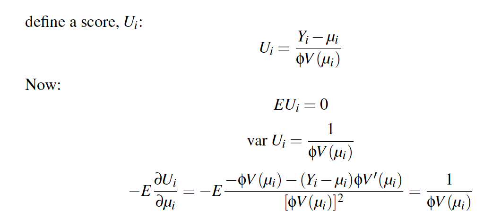

```{r setup, include=FALSE}
knitr::opts_chunk$set(echo = TRUE, fig.align = "center")
knitr::opts_chunk$set(fig.align = 'center')
library(faraway)
library(dplyr)
library(ggplot2)
library(gridExtra)
library(printr)

theme_set(theme_minimal()) # automatically set a simpler ggplot2 theme for all graphics
```

- So far we spoke about single point data. There is each item in our dataset, it's basically 1 person or one thing, and they have an outcome of either true of false.
- Say we have 10 ppl, 5 from NY and 5 from Cali. We're trying to see how many of them moved to Chicago. We can group all those folks together, and basically summarizes the data in two lines. Aka, how many ppl are in a group and how many of those ppl moved? - this is the binomial distribution.
- The Bernoulli distribution, which we have been talking about, is a special case of binomial distribution with one case, or trial.

# Binomial Regression Model

## Generalized Bernoulli (binomial distribution)

-   $Y_i$ for $i = 1,..., n$ is binomially distributed $B(m_i, p_i)$

$$
P(Y_i = y_i) = {m_i \choose y_i}p_i^{y_i}(1-p_i)^{m_i - y_i}
$$

- The equation above, the first part is m choose y, and then the second part looks like the Bernoulli distribution. If you only have one trial (that means your m=1), this equation simplifies to the Bernoulli distribution.
-   For example there a $m$ coin flips with the same coin (e.g. a quarter) and $y$ heads. The quarter has probability $p$ for landing heads up.

## Log-likelihood

- Same as we did before, we're going to create a link function for p for a linear predictor, and use the same logistic link function. Using that, we can come up with the log-likelihood.
-   Use logistic link function $\eta_i = log(p_i/(1-p_i))$
-   Use the same $$
    l(\beta) = \sum^n_{i = 1}{y_i\eta_i - m_ilog(1 + e_i^\eta) + log{m_i \choose y_i}}
    $$
- The log likelihood given a linear predictor, which is made up of different parameters of betas, is def by the equation above.
- Again if you put m=1, this equation becomes the same thing as the Bernoulli log likelihood.

## Challenger Example

- The challenger example is the example of an exploding issue with the O-ring. The deal was in the 1986, it was apparently very cold outside during takeoff. The issues was that one of the O-rings, a seal somewhere along the line of the rocket booster, broke and the rocket exploded on its way up. 
- One of the questions is that should we have known about that prior to the rocket launch? So one of the ways is to look at previous launches and to see if there’s a relationship between outside temperature and the damaged O-rings.
- Apparently from previous launches (10-20 launches), each one has 6 O-rings and they were able to see how many were damaged after each launch attempt.
- 6 O-rings is our Bernoulli trail
-   O-ring damage at different temperatures

```{r}
lmod <- glm(cbind(damage,6-damage) ~ temp, family=binomial,orings)
fake_data <- data.frame(temp = 25:85)
fake_data$pred <- predict(lmod, fake_data, type = "response")
ggplot(orings, aes(x = temp, y = damage/6)) +
  geom_point() + 
  geom_line(data = fake_data, aes(y = pred), linetype = "longdash") +
  scale_x_continuous(breaks = c(31, 40, 50, 60, 70, 80))
```

- What this graph is showing on the dots, is the temperature  and the percentage of O-rings that were damaged. The ones on the x-axis were presumably okay but still had damaged O-rings.
- What we see here is when were at the higher temperature , very few are damaged. When we start to get lower, there's one big point that looks higher but it looks like it could be trending upwards a little bit.
- This is just an example of a fit of the curve, this is the curve that's fit to the data, the binomial distribution. In this case the lowest temperature was 31 or something.
- Only up to 6 can be damaged, the .16 point is maybe just 1 damages, the .80 is prob 5 damaged.

## Fit a binomial model

- So what we have is in the O-ring data set, we have just the number of damaged O-rings. The way the binomial family here takes the data on the left side is with this funky c bind column, which is column bind by putting two columns together and binding them together. 
- What we want is the positive cases (not meaning good but what we're interested in, in this case damage) and failed cases, negative. So the damage here is a number between 1 and 6, and we're doing 6-damage as the other column. It’s repetitive but just the way the function takes in the info, it needs to know how many succeeded how many failed. 
- That's why the left of the code looks a little funky. This totally just depends on the data, sometimes you get data where you have the number of succuss and the number of failed by themselves and you'd just pass those two columns this way. But here we have to do a little bit of work. and the family is the same as we saw before, the binomial family, because the Bernoulli is just a special case of the binomial
- The function is fitting the linear model to the curve, damage is the number of O-rings that were found damaged on the rocket ship. This is previous examples of rocket launches.

```{r, echo = TRUE}
lmod <- glm(cbind(damage,6-damage) ~ temp, family=binomial,orings)
broom::tidy(lmod, conf.int = TRUE)

faraway::ilogit(11.6630-0.2162*31)
```

- Another way of looking at the estimates and the standard deviation and things like that of a model. Just like before we could call summary on this, it prints out a bunch of stuff and then it’s sort of hard to work with, aka maybe unclear on how to get the coefficients. 
- There is another package that helped standardized the output of a lot of the summary calls. and there's a lot of stuff that it does and it works with a ton of packages. It puts everything into a nice table for you. It puts the coefficients name, estimates, std error, statistic, p-value, confidence lower and confidence high into a very nice table.
- Broom tidy means you want the tidy output of the coefficients and call it on the mod, and I want it to give out the confidence intervals. If you look at the summary you’ll see the same exact values.
- The "brome::" means that the tidy function comes from the broom package. It’s not necessary  to do, for example if you call library broom beforehand. But in terms of presenting this, it's a very nice way of making it very clear of where a function comes from. Sometimes if you just see another function you might not know what package that function comes from.
- In python it's with dots, in r it’s with ::

- Similarly we can create predictions. In the same way we have been talking about it so far. So if I want to predict the probability of an individual ring failing, how can I do that? I look at the linear estimate, 11.66 is my intercept plus -.21*31. 31 because I’m interested at 31 degrees, what the chance of failure is. 
- The faraway package has this nice function called the inverse logit, which I think we defined last time as well, again just to show you it's predicted so might as well use it and we get a probability of 99%. That’s a very high chance of failure, the percentage of rings that would fail at this temperature 31, the temperature outside with the rocket was launched. If we have 6 rings, 99% of them would fail, that means possible all of them. I don’t recall in the disaster experiment of all of them failed or only 1 failed.

## Deviance

$$
D = 2 \sum_{i=1}^n \left( \frac{y_ilog(y_i)}{\hat y_i} + \frac{(m_i - y_i)log(m_i-y_i)}{m_i - \hat y} \right)
$$

-   Deviance is $\chi^2_{n-q-1}$ to check fit
- With the Bernoulli distribution you can’t check fit, but with binomial distribution you can

```{r, echo = TRUE}
# chi squared test, with residuals
# the 16.9 is the deviance and the df residual is 21, seen in the glance function 
pchisq(deviance(lmod),df.residual(lmod),lower=FALSE)

# NULL Model
pchisq(38.9,22,lower=FALSE)

broom::glance(lmod)
```

- The chi-squared test is 0.7 is the deviance, It’s not different which means that it's not fitting poorly, meaning that it not incorrectly fitting. where the null model is does not fit well 0.01. same stuff you get out of the summary function. 

# ???
 What are is the reference for this test?^

- Again you can get it quickly with the broom package. The glance function gives you a one line summary per model. Where the tidy function gives you a line per parameter. 
- You have the null deviance, degrees of freedom of the null deviance, loglikelihood, AIC, BIC, deviance and the degrees of freedom of the residual, nobs 23 (observations)
-   This is an approximation (m \> 5)

## Compare Models

1.  Chi-squared:
- the difference between the model that we were looking at the and the null model. you get a p-value, it's a lot less than .05 suggesting that adding that extra term of temp is helpful in predicting if the O-rings will be damaged.

```{r, echo = TRUE}
pchisq(38.9-16.9,1,lower=FALSE)
```

2.  Z-value
- similarly you can look at the z-value.
- Seeing the z- statistic below. you can see the same thing in the summary call just in a lot more words.

```{r}
broom::tidy(lmod)
```

## Comparison to Bernoulli

-   You 'ungroup' the data and run as Bernoulli
- If you unroll this data, you can see in the textbook, a lot of code
- Instead of looking at the groups, the 6 O-rings all at once, if you put a line in for each of them  you would get the same exacts estimates from the Bernoulli if we ran this that way as you would for this binomial. 

-   You will get the same exact estimates (just no way to run goodness of fit test)
- Everything is the same there but the only thing is you can run that goodness of fit test, because that's not in Bernoulli
- All of these models are related to each other, where the things that we can do with them are similar

## Pearson $\chi^2$

$$
X^2 = \sum\frac{(O - E)^2}{E}
$$

-   For binomial case

$$
O\_s = y, \space  O\_f = n - y \\ E\_s = n\_i\hat p, \space  E\_f = n(1-\hat p) \\ X^2 = \sum\frac{(y - n\hat p)^2}{n\hat p (1-\hat p )}
$$

-   denominator is the variance of binomial variable

## Pearson Residual

$$
r^p_i = \frac{y_i - n_i\hat p_i}{\sqrt{var(\hat y)}} \\
X^2 = \sum (r^P_i)^2
$$ 

- It's useful to use this as a standardized residual

# Overdispersion

## Reasons for poor fit {.larger}

-   If the binomial model specification is correct, we expect that the residual deviance will be approximately distributed $\chi^2$ with the appropriate degrees of freedom. Sometimes, we observe a deviance that is much larger than would be expected if the model were correct.

-   Incorrect model

    -   This is hard to show but sometimes you are limited by the data you have

-   Outliers

    -   Look at the residuals to see if they are driving deviance

-   Sparse data

    -   Small groups (when n = 1 it's binary and this is not valid), under 5 maybe

-   Poor fit may result from an incorrect specification of the error term

    -   $var(y) > mp(1-p)$ is overdispersion (if less than under dispersion)
    - The m in a binomial case is the total number of trials
    - Your variance is actually greater than the variance that is defined by the by the Bernoulli distribution. Your variance of your observation residuals is actually greater than what’s expected. 
    - The reason why we have possible overdispersion in the binomial setting is really because the variance of the estimate is defined by the mean (p) of the estimate. 
    - If you think about regular linear regression with the normal distribution the Gaussian distribution, we have a whole other term for variance, we have the $mu$ term and the variance term. What that means is that we have 2 parameters to estimate, when were talking about linear regression. and when we’re talking about binomial we only have one parameter to estimate. Estimating a 2nd parameter means that we get a little bit more flexibility with the variance because we can basically estimate it. We don’t have that ability in the binomial case. 
    - One way you can think about the residual variance or error term in linear regression, we don’t have an error term with binomial. One way we can think about the error term in linear regression, as sort of an error that encompasses a lot of different things: encompass that fact that our measurements are poor, or that fact that we have a slightly incorrect model, or that we don’t have all the terms that we need to model. We don’t have that when it comes with a binomials. 
    - This constant of overdispersion comes from the fact that there is not independent error term that's available when you do a binomial regression. While it’s something that we do have when you talk about a linear regular Gaussian model.
    - How can we create our own additional error term that allows us to have more variance in the model then we would if we just assumed a straight binomial.

## Overdispersion Example

- Some ways of doing diagnosis on the binomial model
-   Boxes of trout eggs were buried at 5 different locations and retrieved at different time periods. Number of surviving eggs was recorded.

```{r}
data(troutegg, package="faraway")
ftable(xtabs(cbind(survive,total) ~ location+period, troutegg))
```

## Fit Model...

```{r, echo = TRUE}
# location and period as predictors, and using survive and total-survive as response (success and failure)
# cbind is the way that R read the binomial model, you need two values to model, unique to the binomial family
bmod <-glm(cbind(survive,total-survive) ~ location + period, family = "binomial", troutegg)
```

```{r}
# summary or model
broom::glance(bmod)
broom::tidy(bmod)
```

- Main thing is the deviance is much higher than the degrees of freedom of the residual and that suggests that the model doesn’t fit well

## Model Diagnostics

-   Model does not fit well because deviance is high
- Because of this you're going to a low p-value, suggesting that the model does not fit

```{r, echo = TRUE}
pchisq(64.495, 12, lower.tail = FALSE)
```

## Data Checks

-   Half-normal plot (like Q-Q plot but with smaller n) for outliers
-   Graph below adapted from `faraway::half-normal`, but below professor used ggplot and copied some of that stuff over

```{r}
resid <- residuals(bmod)
x <- abs(resid)
labord <- order(x)
x <- sort(x)
i <- order(x)
n <- length(x)
ui <- qnorm((n + 1:n)/(2 * n + 1))
data.frame(
  ui = ui,
  abs_resid = x[i]
) %>% 
  ggplot(aes(x = ui, y = abs_resid)) +
  geom_point() +
  geom_abline(intercept = 0, slope = 1, linetype = "longdash") +
  coord_equal()
```

- This plot is like the Q-Q plot, but instead of looking at the full normal distribution it does a half normal distribution. And so all it does is that it take the absolute value of the quantiles and mirrors to normal curves. 
- This allows toy maybe a little bit easier to detect outliers when there isn’t a ton of data. You can imagine this be a more spread out for less data.
- For this plot to look at it, if for any points that are individually sort of out of whack. here it’s almost like to sets of data, like two separate lines, so I wouldn’t say there's outliers here, but there is something funky going on in the data because we want them to follow the dotted line

## Interaction Plots

- Two main pieces to this plot: 1st, the fitting of empirical logit, which is an estimate of the empirical log odds. What we’re doing here is we're basically creating the odds of survival by taking survival and dividing by the total minus the survival. But we’re adding this .5 to avoid dividing by zero. So if everyone survives then the total minus the survival will be zero and that's a problem. So this is sort of a dirty trick you have to pull to it. 
- All these techniques and when you just talk about probability and things like that they don’t do with zero precent or 100%, this is an example of that.
- Why .5 is because you have to look at the data given to you and these values are sort of 100 so .5 does not really change that. But sometimes when you’re working with really small numbers sometimes you can add .5 because it’ll really change the estimate.

```{r, echo = TRUE}
# no obvious changes in slopes of lines
troutegg %>% 
  mutate(elogit = log((survive + .5)/(total-survive+.5))) %>% 
  ggplot(aes(x = period, y = elogit, linetype = location )) +
  geom_line(aes(group = location))
```

- In here, the response variable is a combination of two things (success and failure), it’s kind of hard to see how to they go together so elogit is a way of creating a single "observed" value that you’re going to model. And we do it on the log odds scale because that is what the linear predictor is on. It’s often easy to look at the linear predictor in this case because it's easier for us to see linear patterns than curvilinear ones.
- The x-axis is the time period, the line type is the location. What we’re looking for here is any weird out of whack lines that crisscross each other. What we're seeing here is that the slope of these lines is more of less similar and trends down. The longer you keep touch eggs in a box the fewer survives. If you see a wild line that crisscrosses from the 0,0  point than that's something to investigate.
- This plot doesn’t show anything weird going on, even though 5 is weird. the focus of these plots is to look at the slopes of the lines. The slopes in this seem similar enough.

## Expected vs Actual

```{r, echo = TRUE}
# interaction plot
troutegg %>% 
  mutate(pred = predict(bmod, ., type = "response")) %>% 
  ggplot(aes(x = survive/total, y = pred)) +
  geom_point() + geom_abline(slope = 1, intercept = 0, linetype = "longdash") +
  facet_wrap(~location) + coord_equal()
```

- What the professor prefer is to look at the observed and predicted plots that we focused on with the linear regression. 
- This plot, the x-axis is the observation value (the p, survival/total) and y-axis is the prediction from the response
- Here you can break these plots up by different values, here it's broken up by location. You can also do the same thing by looking at periods or something like that. Instead of doing the facets (these little boxes), you could do like a different color or a different dot shape to explore the data that way. 
- It looks like the model is estimating these values pretty well. The predictions are similar to the observation values. Seems like the model is fitting reasonably well
- The problem with overdispersion is that you look at few things and you can really figure out what else is going on, you just turn to overdispersion a reason. That way it can be a good analogy to a linear regression because you basically have the built into a linear regression you just don’t really think about it. The fact that you have this error term is really nice because if there is something super wonky in the model it just gets rolled int this error term. As long as the other parts of your linear model is okay, you could have a huge error term and that doesn’t make that your  model is incorrect, you’re just going to have very big confidence interval. 
- The book goes though this is looking at different ways of understanding the data and the result is that the model looks sort of reasonable, yet our deviance is too high. How can we fix the high deviance. one way to do that it to expand the amount of error that we give the model. 
- Ultimately even though the model fits, the underline is not actual binomial because binomial variance depends on the mean. 

## Overdispersion Reasons

-   Missing predictor variable

    -   If temperature is not the only predictor (still missing information), temperature because of challenger example

-   Clustering
    - If there is clustering in your data that you aren’t modeling
    - Instead of having one big population that follows the binomial destruction, if you have a bunch of different clustered of population and the clusters could be clustering for a variety of reason, but you just don’t know about that,
    -  Instead of modeling data that's truly separated. You actually look at data that has a weird clustering in the background. It’d be unlikely and you could just not know about it. On average you might have a particular variance, or a particular probability of success.
    -   Imagine sample size $m$ with $k$ in each cluster and $l = m/k$ clusters
    -   Each cluster share the same $p_i$ so that the successes in cluster $i \sim B(k, p_i)$
    - What you could have is still a variable that has a global average (p) that’s accurate but variance is going to be higher than p*1-p
    -   $E p_i = p$ and $var \space p_i = \tau^2p(1-p)$
    -   successes $Y = Z_1 + \cdots + Z_l$
- Clustering and missing predictor variable is sort of the same because clustering happens for a reason. Cluster happens in space, all these things are close to each other and if you're not modeling the distance in the points accurately, it’s not going to be a part of the model.

## Overdispersion | Clustering

$$
EY = \sum EZ_i = \sum_{i = 1}^l kp_i = mp 
$$ 
$$
var \space Y = \sum var Z_i = (1 + (k-1)\tau^2)mp(1-p)
$$ 

- However when you model the terms together, you basically this extra coefficients (1+(k-1)t^2), your variance is higher because of this part in the equation. You can see that because that term is greater than 1, and that's going to make it greater than seen below
- which is greater than $mp(1-p)$

## Expected vs Observed Variance | Create Data

- Here I’m creating 10 clusters, 
- Run if it is a function that is giving 10 random numbers between 0-1, convenient way to look at the prob. 10 clusters is giving 10 random number.
- If this is a uniform distribution between 0-1 variable, which it is because that’s the definition of a function, what’s the expected value of all these numbers? It’s just going to be .5. we're expecting a probability of .5 on average
- I use the binomial sample function (rbinom) and I sample 100 times, size groups f  5, with the probability from this group of (groups function) 10. So I’m doing basically 100 trials, size 5, times the prob one of these 10 numbers. And I’m doing it 100 times for each of those 10 numbers
- How many trials am I going to have to look in the end, 100 times sampling for each of one of these 10, it’s going to be 100*10=100 trials. Each one of these is going to have some sort of success, out of 5 total subjects theirs each going to have a probability of success of one of these 10 numbers.

```{r, echo = TRUE}
set.seed(01928)
groups <- runif(10) # probabilities between 0 and 1
all_obs <- sapply(groups, function(x) rbinom(100, size = 5, prob = x))
ungrouped <- as.vector(all_obs) # convert from matrix to 
head(ungrouped)
```

-  What’s going to happen is these 1000 numbers are actually going to come out as a number between 0-5, saying how many succeeded how many didn’t and these are the probabilities. Here is just a look at the data, 1000 values here but these are the first 6. 
- What is the average of this entire vector, what is the average number of success? What do we know is the average probability that we're expecting from the groups, it’s going to be .5. 
- If you take 5 people from the example and you count the number of women per group. And you have 100 groups of 5 people, how many women do you expect per group, 50%man 50%women? There’s only 5 people each group, how many women do you expect to have in each group, half. That means you'd expect 2.5 per vector.

## Expected vs Observed Variance | compare observed vs expected

```{r, echo = TRUE}
# estimate_p
(obs_p <- mean(ungrouped)/5)

#varaince based off observed p
5* obs_p * (1- obs_p)
 
# observed variance
var(ungrouped)
```

- From the data that we just saw, we can estimate the probability here. We know that the average probability is .5, and our data shows a close probability of .498
- What do expect the variation in this case? If this is a true binomial process it’s going to be 5 (because 5 ppl) times probability times 1-p =  1.25.
- However, when you look at the variance you get a much higher number = 2.65.
- This is an example of overdispersion, the variance of the actual observation data is higher than what our very simple model says. 
- Because of this clustering (the runif function) that's going on in the background you get this higher observation variance than you would otherwise. 
- It’s not really coming from a binomial distribution because these probabilities is not a fixed probability, it’s 1 of 10 random values. It does appear to just become a normal binomial probability, really in the background we don’t know about the clustering because it’s unobserved and that leads to a much higher variance term. This is a good way of showing how overdispersion can happen.
- How can the variance be higher, because the true model is that it's conditionally binomial given the group. The true variance is the sum or weighted average over all of these different group which will be potentially higher. 

## E vs O | Model Version

- How to create the data
- When you do something like just take the mean, like when we take the observed probability and take the mean of you, what you’re doing is fitting the model with just an intercept term and that applies to linear regression as well.
- What we can do is show this within what we just looked at. If you create this fake data (ungrouped is the data set that we were looking at earlier) and I create this success and failure column, and just use this glm command like you would when you do a really data analysis and you look at the info for it you see

```{r, echo = TRUE}
sim_data <- data.frame(success = ungrouped)
sim_data$fail <- 5-sim_data$success

sim_mod <- glm(cbind(success, fail) ~ 1, data = sim_data, family = "binomial") 

broom::glance(sim_mod)
broom::tidy(sim_mod, exponentiate  = T)
```

- You see that the deviance is much higher than the residual. It’s showing as the same thing, in this case because we simulated the data we know the response for this deviance not being correct and that is because of those groups. But if we just go to this data, we wouldn’t know and say that its weird and it’s not really fitting the data.
-  We always talk about how confident are odds ratios, but that doesn’t really work here. And the reason is because it's an intercept, it’s not really an odds ratio because it’s not changing, the intercept is always there. 
- I exponentiated the estimate, this means we're looking at an odds. Are there any other predictors in the model? No.
- What the intercept estimate represent is sort of the starting rate, if we had other values, other predictors, they would change the odds. But that is just the odds. the odds of 1 mean that 50%, and that is probability .498 from the estimate of probability before. This is the observation mean of the model. 
- To revert the .99 odds into probability, is .992/(1+.992) = .498. which is the exact same value we got when looking at the mean.
- An odds ratio needs to apply to something, it needs to start at a base value, in this case it's more clear because we don’t have any predictors and the base value is an odds of .992. It’s another way of tying how we see and estimate these values of probability with just algebra and how that’s very closely tied and can be done in a generalized model.
- The base odds don’t necessary have to be one, only because in general something happens 50% of the time. But if something doesn’t have 50% of the time, the base odds are not going to be 1. We don’t generally care about what the base odds of anything is. We care about how different factors change those odds. Which is why we talk about the odds ratio of other predictors and don’t focus on the intercept.
- This is showing how you can get the same probability here and how it can come from an advanced framework like this.

## Modeling Overdispersion \| Dispersion Parameter

$$
var \space Y = \sigma^2 mp (1-p) \\
\hat\sigma^2 = \frac{X^2}{n - p}
$$

- To incorporate overdispersion into the model, we can put a scalar term in front of the binomial variance. In this case it's recommended to use the Pearson chi-squared to estimate that dispersion term 
- To account for dispersion in the model, we have to deal with the fact that the model isn’t fitting the data via the deviance. This is one way is to allow the variance to scale by a factor.
-   What do we expect $\hat\sigma^2$ to be if there is no overdispersion? It'd be one. If that is one then this is just a regular binomial distribution

## Modeling Overdispersion \| Dispersion Parameter

- All this does is it changes the variance of the estimates, so our point estimates are not going to change at all but the variance of those estimates will, it gets scaled by this value
-   This scales the standard error of all parameters by $\hat\sigma$

$$
\hat{var} \hat\beta = \hat\sigma^2(X^T\hat WX)^{-1}
$$

## Compare models using F statistic

$$
F = \frac{(D_{small} - D_{large})/(df_{small} - df_{large})}{\hat\sigma^2}
$$

- It’s not no longer chi squared because we have this other estimate, so we can use the F statistic

## Modeling Overdispersion \| Trout Example

- The sum of the person residuals squared (X2)/ by the df of the residuals

```{r echo = TRUE}
# standard error on the sigma^2 scale
sigma2 <- sum(residuals(bmod, type = "pearson")^2/df.residual(bmod))
sigma2
```

- This is much higher than 1. And the way you can sort of look at it is .

## Summary Statistics \| No Dispersion

- You don’t need to refit the model, because all you're doing is changing the standard errors.

```{r, echo = TRUE}
summary(bmod)
```

## Summary Statistics \| Dispersion

- In this you just pass the dispersion parameter here in sigma 2

```{r, echo = TRUE}
summary(bmod, dispersion = sigma2)
```

- Instead of the standard errors being 0.2813, they are modified and are about square root of 5.33 (sigma2), it becomes 0.64. The standard errors go up, the estimates stay the same.
- Here you can’t do the broom glance because it doesn’t take the dispersion value
- The deviance is no longer valid because it’s not a binomial distribution
- This is just sort of saying I can’t do anything else, but in order to deal with this overdispersion, I'm going to scale all my standard error by a value. You can see that the p-values take a hit because of that, you lose confidence in your estimates which is fair because it’s not as correct as before

# Quasi Binomial

## Set up {.larger}

-   Specify the mean and variance of the response as functions of the linear predictor
-   You do not need to make an assumption about the underlying distribution that these two values describe
-   It's possible to set up quasi-likelihood functions that mimic likelihood functions, without having to know the entire distribution
-   This allows you to calculate the quasi-deviance/standard error etc.
- The likelihood function is defined by the distribution that we're using, but for this I don’t need to know the full distribution to use likelihood like methods to model data.

## Quasi Binomial - formulas

-   Assume that: $mean(Y_i) = \mu_i$ and $Var(Y_i) = \phi V(\mu_i)$
-   Note that the mean and Var are just functions of $\mu$ ($\phi$ is a scalar)
-   the E represents the expected values

```{r, out.width="75%"}

```

- This is saying you can create this value, this $U_i$. It’s the random variable - $mu$ (the avg)/ 5 (the scalar) times a function of $mu$. What this is saying is that you are defining the variance of something by using it's expected value. The $mu$ here is the expected value. The variance is a function of that expected value. 
- This value $U_i$ is similar to the derivative of the loglikelihood, so the derivative of the loglikelihood have the same properties as $U_i$. Which means we can use the integral of $U_i$, we can use it as a fake loglikelihood. That fancy thing here is that we get a "loglikelihood" without actually defining a distribution.

## Score function vs log-likelihood

-   These properties are shared with the derivative of the loglikelihood (see page 376 of text)
-   Therefore $U$ can be used in place of $l'$ (the derivative of the log-likelihood)

Quasi log-likelihood:

$$
Q_i = \int_{y_i}^{\mu_i} \frac{y_i - t}{\phi V(t)} dt
$$

- The loglikelihood of a point is $Q_i$.  

$$ 
Q = \sum_{i=1}^n Q_i
$$
- The entire loglikelihood the sum of all the $Q_i$'s.

## Likelihood Comparison

-   See the Appendix of book for more details

-   What is $V(\mu)$ for the standard linear model?
- How does the variance change with $mu$? It doesn’t. V(mu) = 1 for the standard linear model. But what that says is that we don’t need to do the quasi Gaussian thing because you're sort of all ready assuming that the variance doesn’t change with $mu$
-   Although quasi-likelihood estimators are attractive because they require fewer assumptions, they are generally less efficient than the corresponding regular likelihood based estimator. So if you have information about the distribution, you are advised to use it.
- Generally this mean that your standard errors will be wider because you’re not using all the info that is in the distribution.

## Quasi Deviance

- Same as before we can def a quasi

$$
Q = -2 \sum_i \int_{y_i}^{\mu_i}\frac{y_i - t}{ V(t)} dt
$$

## Example Data

- This is looking at how much mammals sleep

```{r, echo = TRUE}
data(mammalsleep, package="faraway")
mammalsleep$pdr <- with(mammalsleep, dream/sleep)
summary(mammalsleep$pdr)
```

```{r, echo = TRUE}
# you can use the quasi binomial family in the equation, it atomically estimates the dispersion parameter for you. If you use this, you don’t have to do the summary(bmod, dispersion = simga2).
modl <- glm(pdr ~ log(body)+ log(brain) + log(lifespan) + log(gestation) + predation + exposure + danger, 
            family= quasibinomial, mammalsleep)

# in here the glance method would work
```

## Summary of Model

```{r, echo = TRUE}
summary(modl)
```

## Step the model and show summary

```{r, echo = TRUE}
drop1(modl, test = "F")
```

## New model after selecting variables using F test

- Variable transformations
- This is taking the natural log of the body value which is a measure of size of an animal.

```{r, echo = TRUE}
modl <- glm(pdr ~ log(body) + log(lifespan) + danger, family= quasibinomial, mammalsleep )
broom::tidy(modl)
```

- If you see log(body), how do you interpret this estimate? 
-   What does the log of the predictor variable represent?
- You would expect it to get an odds ratio, 
- exp(1.15) is the odds ratio that we're interested in. We can’t say the odds ratio goes up by 1.15 for each bit of body mass because we're transformed the body mass variable before doing so. 
- It’s actually squaring it, so for every time you square the body weight, the odds ratio goes up by 1.15

## What happens on the linear scale?

```{r, echo = TRUE}
# create fake data with the mammal sleep, run the body from .005-6654
fake_data <- data.frame(body = seq(0.005, 6654, length.out = 10000))
copy_d <- mammalsleep

# do two things: create a linear model where it's just body, and one where it’s the log of the body. same models just transforming the data
mod_lin <- glm(pdr ~ body, family= quasibinomial, mammalsleep)
mod_log <- glm(pdr ~ log(body), family= quasibinomial, mammalsleep)

# create predictions from both of those
fake_data$linear_body_pred <- predict(mod_lin, fake_data, type = "response")
fake_data$log_body_pred <- predict(mod_log, fake_data, type = "response")

# And I do it in the mammal sleep data so it doesn’t mess of that actual data
copy_d$linear_body_pred <- predict(mod_lin, copy_d, type = "response")
copy_d$log_body_pred <- predict(mod_log, copy_d, type = "response")
```

## Look at fake data

```{r}
ggplot(fake_data, aes(x = body)) +
  geom_line(aes( y = linear_body_pred, color = "Linear")) +
  geom_line(aes( y = log_body_pred, color = "Log"))
```

- Here is the prediction of the amount of sleep a body is going to get, based on the body weight over here. The red line is the linear value, showing as you go from various small body weight to a high body weight, you go almost from zero percent sleep to 80% sleep. It’s not necessarily reasonable for it to change that much.
- However the log version, it doesn’t change that much and stays a lot more flat at .25 

## Fake data zoom in

```{r}
ggplot(fake_data, aes(x = body)) +
  geom_line(aes( y = linear_body_pred, color = "Linear")) +
  geom_line(aes( y = log_body_pred, color = "Log")) +
  coord_cartesian(c(0,1000))
```

- It’s very similar and overlaps a little bit. Either its log or linear the estimates are pretty similar for this section of body weight

## Look at fitted values

- Looking at the raw data

```{r}
ggplot(copy_d, aes(x = body)) +
  geom_line(aes( y = linear_body_pred, color = "Linear")) +
  geom_line(aes( y = log_body_pred, color = "Log")) +
  geom_point(aes(y = pdr, color = "Actual")) +
  labs(y = "")
```

- You can see this play out looking at the raw data. Most of the data about the body weight is over here, towards 0. There’s one point at like 2500 and one pint at 6500.  Looking at this raw data, it’s pretty unreasonable that these two points over here define the entire linear space.
- And so logging the predictor variables is a good way of diminishing the effect of outliers. Its often done with things like body weight or height or sort of things thar are often very skewed pieces of data. It often helps the model preform a lot better.
- The log of the predictor variable is a good way to diminish outliers in the predictor variable. This body variable runs from 0-6000, but most of the data is focused around zero, so by taking the log of it you sort of compress it and you diminish the effect of outliers in the prediction variable
- Every time you square the variable, that’s how much the odds ratio goes up. But when you go from 2000-6000 you're not squaring it you're multiplying it by 3, It’s not 2000*2000. That’s why the log becomes more flat as you move down the variables.

# ??? 
Does that effect any other statistical values? ^

## Beta Regression

- Another way to deal with overdispersion. 
- One of the other ways is instead of using binomial distribution, you can use a beta distribution.
- The beta distribution like the linear regression includes another parameter which helps model the variance of it;
- The beta is a really nice distribution for modeling anything that runs between two fixed numbers. In this case it’s 0 and 1, but its continuous
-   Useful for bounded regression (e.g. $[0, 1]$)
- Another type of likelihood or distribution you can use to model data

$$
f(y|a,b) = \frac{\Gamma(a + b)}{\Gamma(a)\Gamma(b)} y^{a-1} (1-y)^{b-1}
$$
- reparametrize so that $\mu = a/(a+b)$ and $\phi = a + b$ and set $\eta = logit(\mu)$

## Fit Beta regression

```{r, echo = TRUE}
# Because it's not a function in R, you need use this mgcv package
suppressPackageStartupMessages(library(mgcv))
modb <- gam(pdr ~ log(body)+log(lifespan) + danger, family=betar(), mammalsleep)
summary(modb)
```

- The point is there are other distributions out there then the normal glm function and sometimes you have to use them
- You can interpret it the same way.
- You may have to transform them to get them into an interpreted value

- Instead of using the quasi methods or the dispersion parameter, I prefer to think about how to model the actual full distribution. Just because the binomial distribution doesn’t allow for variable parameter there are other options out there. There are also methods like hierarchal modeling which can deal with overdispersion, another way of adding a variance term in sort of a general way to an equation.


