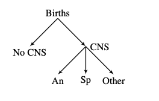
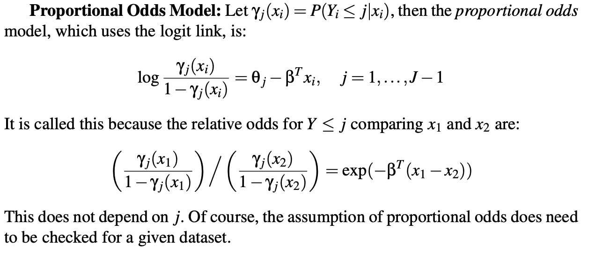

# Start at lecture 11

```{r setup, include=FALSE}
knitr::opts_chunk$set(echo = FALSE)
knitr::opts_chunk$set(fig.align = 'center')
library(faraway)
library(MASS)
library(dplyr)
library(ggplot2)
library(gridExtra)
library(printr)
library(tibble)
library(purrr)
library(broom)

theme_set(theme_minimal()) # automatically set a simpler ggplot2 theme for all graphics
```

# Multinomial Logit Model (Chapter 7)

## Set Up
- (Note we are skipping Chapter 6)

- A multinomial distribution is an extension of the binomial (binary variable) where the response can take more than two values. 
- Let $Y_i$ be a random variable that falls into one of a finite number of categories (1, 2 ... _J_). Yi is sort of the label like blue

- Multinomial data is data where the response can take more than two values. So when we were looking at binary data, we were looking at yes or no, true or false, 1 or 0 things like that. here we're going to be looking at groups, for example you can be red or yellow
- The way that this is going to be set up is that there is going to be a random variable Y and it's going to fall one of J categories. 
- $p_{ij} = P(Y_i = j)$ and $\sum_{j=1}^J p_{ij} = 1$
- When does this become the binary case?

- Let $Y_{ij}$ by the number of observations that fall into category _j_ for observation _i_. $n_i = \sum_j Y_{ij}$ For a particular observation or row of dataset, how many fall into the Jth category. 
- And if you add up all the $Y_{ij}'s$ over all the J's, you get Ni and that's you total number of trials
- What are $n_i$ and $J$ for Bernoulli? When n is one, J is equal to 2. Basically you only have 1 trail so all across your Yij's you only get one.

Probability density is defined below:
the n all over the different counts of each one multiplied by the different probabilities

$$
P(Y_{i1} = y_{i1}, ..., Y_{iJ} = y_{iJ}) = \frac{n_i}{y_{i1}!...y_{iJ}!} p_{i1}^{y_{i1}} ... p_{iJ}^{y_{iJ}}
$$

- Ordinal vs multinomial data :  when you're categories are unordered, it’s just multinomial data. For example, red blue yellow, unless there is a reason for ordered there is no there. On the flip side, something like poor mediocre good, even though those are just categories, there's still a natural ordering to them. And that's going to very much depend on the way that it's set up and how its supposed to be interpreted.
- When you have ordinal data, you do get to use that in your modeling. And it can sometimes help both with interpretation and just modeling fitting in general. It’s a nice way of adding some structure because sometimes if you have like a 100 categories of something it's really hard to do regression with must multinomial data.

## Election Study :)

- Note that they did collapse all the different versions of democrat, independent and republican into 3 categories.
- Collapse party into 3 categories and create numeric value for income (code not shown)

```{r, echo = FALSE}
data(nes96, package="faraway")
party <- nes96$PID
levels(party) <- c("Democrat","Democrat","Independent","Independent", "Independent","Republican","Republican")
inca <- c(1.5,4,6,8,9.5,10.5,11.5,12.5,13.5,14.5,16,18.5,21,23.5, 27.5,32.5,37.5,42.5,47.5,55,67.5,82.5,97.5,115)
income <- inca[unclass(nes96$income)]
rnes96 <- data.frame(party, income, education=nes96$educ, age=nes96$age)
```

- This looks at the income in thousands, the education and the age of the person and what party they fall into. 
- Can education be an ordinal variable or a multinormal one? It could definitely be an ordinal because education can be thought of in a linear way. You could run into a problem if they were different types of bachelor’s degrees here and then if would be harder to order them naturally since its more or less the same amount

```{r, echo = TRUE}
summary(rnes96)
```

## Some Graphs - Party by Education

- This is a graph that's looking at the proportion of each party. All we do is look at the numbers by the party. 
- When you look at education you see that the amount of democrats drops down with a higher education and independent is about steady and republican goes up and then plateaus. And in the middle here they are very sort of on top of each other. 

```{r}
rnes96 %>% 
  group_by(education, party) %>% 
  summarise(n = n(), .groups = "drop_last") %>% 
  mutate(prop = n/sum(n)) %>% 
  ggplot(aes(x = education, y = prop, linetype = party)) +
  geom_line(aes(group = party))
```

## Some more graphs - Party by Income

- They did some grouping of the data and as you all know I’m not a huge fan of that method so I prefer use smoothing functions and in fact each of these different points are individual people
- As income goes up, the percent of democrat goes down and see the upward trend with independent and republican.
- The first thing that I notice here is that the graphs are sort of similar in both cases and that makes me feel that income is probably corelated with education.
- Income is one the x-axis, and were looking at the proposition of the three different groups you can be in

```{r}
rnes96 %>% 
  group_by(income, party) %>% 
  summarise(n = n(), .groups = "drop_last") %>% 
  mutate(prop = n/sum(n)) %>% 
  ggplot(aes(x = income, y = prop, color = party, weight = n)) +
  geom_point(alpha = .3) +
  geom_smooth(method = "loess", se = F, formula = y ~ x)
```

# Ordinal vs non ordinal 

```{r eval=FALSE, include=FALSE}
rnes96$education # you can see that it's in ordinal already
rnes96_not_ordinal <- rnes96
rnes96_not_ordinal$education <- factor(rnes96_not_ordinal$education, ordered = FALSE)
rnes96_not_ordinal %>% glimpse # now it’s just a normal factor
rnes96 %>% glimpse # the main one is ordered

# let's fit two models
library(nnet)
mmod_not_ord <- multinom(party ~ age + education + income, rnes96_not_ordinal)
mmod <- multinom(party ~ age + education + income, rnes96)

# check the df
mmod_not_ord$edf
mmod$edf 
# It's weird that it’s the same amount. It doesn’t make sense because if you withhold information you should have fewer degrees of freedom because each category is not able to do what it wants. It has to be either higher or lower than the previous one. 

# check AIC
AIC(mmod_not_ord)
AIC(mmod)
# It’s the same, weird. 

summary(mmod_not_ord)
# It is possible that this particular implementation (multinom) does not actually do ordering variables. It is not respecting the ordered column because it doesn’t really use categories like this educationHSdrop. 
#so I think that's the problem. The problem is the multinomial algorithm is not respecting ordered variables. There is nothing to do about that but I’m sure there's something out there.

# try this
lm(income ~ education, data = rnes96_not_ordinal) %>% summary() # this is normal 
lm(income ~ education, data = rnes96) %>% summary() # you see that it's not the same. Its doing something very different in the background. The education L stands for linear, .Q = quadric, .C = cubic, ^4, ^5, ^6 to the 4th, 5th, 6th terms. What you can usually do is you can actually chop off some of these, you don’t need to you all of them. That's the benefit you can get when you use ordinal variables as predictors.
# They both have the same amount of degrees of freedom
```

## Fit the Model

```{r, echo = TRUE, message=FALSE}
# These models require a different package, nnet which stands for neural net. Only reason is because the optimizer it uses comes from there
# the function here is the multinom function
library(nnet)
mmod <- multinom(party ~ age + education + income, rnes96)
mmodi <- step(mmod, trace = 1) # we can also use deviance etc.
```

- The only funny thing here is that it sort of spits out this extra text. Not entirely sure what it's showing, I’m wondering if it’s the AIC or the deviance or the likelihood. But the nice thing is because it's still part of the same group of models that we've been looking at, we can use all of the same tools to pick variables to test nested models with this model as well.
- Here I’m running the step function to figure out which variables should be included in the model, and again it continuous to spit out information even though I don’t ask it to.
- In the end, age and education were both removed from the model. It’s not surprise that both education and income didn’t say in there. Honestly when variables are correlated like education and income, often times the continuous variable is a little bit better to use. One of the main reasons for that is that education variable has 6 or 7 categories, that's 6 or 7 degrees of freedom. However if we just use income which has more or less information, that's only one degree of freedom that we're using. 

## Lets just look at income

- First thing is I'm going to make some fake data. as we saw before, it only contain income, which ran from about 1-115. So we're going to create some fake data that's going to run from 1-110. We're going to create predictions from the model we just created. The predictions are going to be precent likelihood that you are democrat given you have an income of x. Likewise for independent and republican. We get all three outputs. 
- It's very different in the binary case because we only need to just have one thing out, like we only needed the probability of the positive case whatever that might be. 
- Are we regressing income onto everything else or are we regressing party onto everything else? So party is the outcome variable and income is the predicting variable. 

```{r echo = TRUE}
fake_data <- data.frame(income = 1:110)
fake_data <- cbind(fake_data, predict(mmodi, fake_data, type = "probs"))
summary(fake_data)
```

- At each income what is going to be the sum of chances of democrat, independent, and republican in this case for each row? 1. You can only be in this world one of three things, democrat, independent, or republican. So for each row, at income level 1, we need to be able to say okay if there is an 80% democrat 10% independent, we know there's going to be 10% chance you're a republican, because they all have to equal to 1.

## Income as a graph

- This is now the model that we fitted. It’s obviously a smooth version of some of the other data we saw. 

```{r echo=TRUE, fig.height=3, fig.width=6}
fake_data %>% 
  tidyr::pivot_longer(-income) %>% 
  ggplot(aes( x = income, y = value, color = name)) +
  geom_line()
```

- What will be chosen as the prediction at different income levels?
- So at income level's 30, there is a 46% chance thar you’re a democrat, 30% chance you’re a republican and a 20% change you’re an independent. So if I had to ask you, when will the model predict an independent? At what income level will the model predict an independent? What will the model predict at 30,000, what is the most likely party? Democrat. What about at 60,000? republican. So how are you finding this? We're looking at the highest line. 
- Will independent ever be chosen?
- Is there any income at which independent is actually chosen? No, because it falls beneath both ranges of the democrat and republican parties. That’s okay and that's how the model works. It makes sense since there are definitely fewer independents than the other two so it's less likely that just based on income you pick someone to be independent
- This is the output of our model, This is similar to what we would get from a regular binomial model but now it’s three categories.

## Interpret Coefficients

- Now let's talk about what the model actually looks like. What we have here, it’s a little different that what we're used to
- Here they are still in the linear predictors scale

```{r, echo = TRUE}
broom::tidy(mmodi)
```

- What we sort of end up having is two separate models. We have the y level which is either independent or republican. And we have an intercept term and income for each one of them. And each of these have an estimate, along with standard error, statistic and p-value
- Why don’t we see democrat here in the output model? Because it can be inferred from the others. think about it when we do a regular binomial or Bernoulli regression, do you see both categories there or just one? But in a similar way to the binary version, we need a baseline variable. When we look at the output of a binary or a binomial regression, what we’re seeing really is the odds ratio's to the positive class, so if yes was the positive class, the intercept and the coefficients sort of act towards the positive class. We never see anything about the base case. In this case democrat are chosen as the base case, does anyone know why democrat are chosen as the base case here? Because alphabetically, D comes before I and R. 
- This is very similar to when we were talking about the binary classification, depending on the alphabetical order of your outcome variable, the second will be chosen as the positive case. What you have to do is you have to reload the factors if you want to choose something else as the base case

## Interpret Coefficients

- Here is actually how we're going to define the link function and things like that. 
- So we have our linear prediction and that is going to equal the coefficients times the observed variables (in this case we only have 1 of each, we have the intercept and we also have the income are the predictor) and its going to equal the logit link (because it’s the log of two probabilities, the 1j divided by the probability that it falls into the 1st category). This is part of that idea that all are relative. 

$$
\eta_{ij} = x^T_i \beta_j = log(\frac{p_{ij}}{p_{i1}})
$$

One category is baseline such that:
- The probability of the 1st can be inferred as 1-sum of all the other probabilities, everyone excluding the 1st.

$$
p_{i1} = 1 - \sum^J_{j = 2} p_{ij}
$$

Therefore:
- It can turn into a logit link function. And this is what we end up with.
- One of the interesting this is that the first equation actually equals to the second. What we're saying is for the base case for the 1st ij is always going to be zero.
$$
p_{ij} = \frac{exp(\eta_{ij})}{1 + \sum^J_{j=2} exp(\eta_{ij})} \\
 = \frac{exp(\eta_{ij})}{\sum^J_{j=1} exp(\eta_{ij})}
$$
Why?
- So e^0 is always 1, so we can sum up over j from 1 to capitol J, that’s the same thing are the first equation. Because the 1 + part of the first equation is the same thing as the second equation because that value when j=1 is always zero.
- That's how we're going to be looking at this, so we've defined the logit link function.

## Interpret Coefficients (intercept)

- The intercept on the democratic group is zero because it’s the base case and therefore it's always going to be zero. And what we do is we put all those together and we can solve for the probability. 
- So the exponent of all these individually numbers divided by the sum of the exponent of those numbers give you the probability that it falls into each of those categories.
- In the equation, these are the 3 linear predictors for income level 0. Because when the level is 0, you don’t have to worry about the independent estimate 0.016, because its 0 times this number. What we do is we sum of the exp of all those up, and we take each one of them and divided by that and we get each of those values back. And the resulting numbers are the probabilities, those are the ones we care about. 

```{r, echo = TRUE}
cc <- c(0,-1.17493,-0.95036)
exp(cc)/sum(exp(cc))

predict(mmodi,data.frame(income=0),type="probs")
```

- So we have 0.589, 0.182, 0.22. You see that that's the exactly the same results that we get from what were looking at before where we created the reps. 
- Does it make sense that this formula here is the same as the previous formula? From what I understand it’s just the shirting of the index. Because exponent of group 1 is always zero, you're right we end up putting it over here. It just make it a little easer otherwise you would have to add 1 to the bottom of this equation and more (). 

## Interpret Coefficients

- Basically what we can do is look at the 2 estimates, the intercepts for example, so let’s say we take someone who is at income level 0, the linear predictor for those people is just going to be the intercept. So we have the intercept for the independent group and the intercept for the republican group and we have them listed above.

```{r, echo = TRUE}
broom::tidy(mmodi, exponentiate = TRUE)
```

- This is the odds ratio of republican vs democrat

- Here I’ve exponentiated them. What we have here is our odds ratio. We do have the logit link function. This is saying for every one thousand dollars you go up in income, the odds ratio that you are an independent vs a democrat is 1.01. that's how much your odds change every time you go up by everyone thousand dollar in income. 
- You can do the same thing here with the republican, again it’s the odds ratio for the odds of being a republican vs a democrat. How much of your odds of being a republican vs a democrat for every thousand dollar you make more in income? 
- 1.016 is an odds ratio. It is defining the change in odds from being a democrat to being an independent for every one thousand dollar more you make in income. Similar here, we are saying the odds ratio of being a republican goes up by 1.017. 
- The odds ratio changes the odds in a multiplicative sense. If you have an odds that you're a democratic, let’s say 50% so you're odds are 1. And then you make a thousand more dollars, it would actually go down a little. 
- Let me say that again. If you’re odds of being a republican are 1 and you more a thousand more dollars, you’re new odds of being a republican are going be 1.017. And that is verses being a democrat because democrats are the thing we're comparing it to. We don’t have to but it’s just a consequence of the output.

What about log odds or odds ratio from independent to republican?
- To be able to do that, you would relevel the data. Let's see what happens when you relevel the data, below. 

```{r}
rnes96_relevel <- rnes96
# making independent the base case
rnes96_relevel$party <- relevel(factor(rnes96_relevel$party,
                                       ordered = FALSE), "Independent")

multinom(party ~ income, data = rnes96_relevel)

multinom(party ~ income, data = rnes96_relevel) %>% 
  tidy(exponentiate = TRUE)
```

- This is the odds ratio, the same thing as the beta's you would get from a binary or binomial regression. It’s an odds ratio because we used that logistic link function. And that means that the estimates when you exponentiated them are odds ratios. An odds ratio always compares two things, an odds do not just like probability does not really compare two things. 
- By saying there is a 20% chance of something happening, you just know that there is an 80% chance of it not happening, doesn’t tell you about what else is going on. 
- An odds ratio needs to compare the odds or the probability of two things happening. And so this estimate is an odds ratio, so we have to ask ourselves what is it comparing? It's looking at republican vs independent, because I releveled the factor.

- Now here we only see coefficients or democrat and republican not independent because we made independent the base case. 
- Now I guess it was a coincidence that democrat was used as a base case because they had actually provided an ordered factor there. But it doesn’t change the way that it used the data

- The second output is now the odds ratio that you're an democrat vs that you’re an independent, this is how much the odds change for every thousand dollars you make more. You basically are less likely to be a democrat the more moment you make vs being an independent. which is sort of what we saw before but now we can see the estimates for that
- One of the interesting things here is when we used democrat as the baseline the relationship to being a republican was statically significant because our p-values were effectively zero and you can also see it very clearly when you look at the estimate and the standard error of the estimate. 
- When you compare independents to republicans, it’s not the same case. Looking at the income level of republican and you can see that it is no longer significant, the p-value is .55 and the estimate is very low. 
- That’s what’s very important when you're using a categorical variable as an output, that you always know what you're base level is. It’s very important to keep in mind. 
- The odds ratio of being a republican, the estimate of that is very different whether you use independents of democrat as the base case. there is not right or wrong which one to use, it's all about what question you’re trying to ask. But it’s important to keep in mind what we're seeing here is that republican income variable is not statistically significant when you compare it to independent, the p-value here is .55. However when you compare republican to the democrat, then it is statically significant. both are true. 
- It all depends on which party you're using as the base. This is an important thing to keep in mind when you're building these models because something might not be significant, for example here. But it's not surprising that the higher income, the more likely someone is to be a republican. But if you weren’t really paying attention to what you were asking, you could look at this and say oh there is no actual statistically significant relationship. The problem is that you comparing republicans to independents as opposed to republicans to democrat, which most people do. It’s all a word of cation to consciously chose you base case.

# Hierarchical or Nested Responses

- This is not the same as random variables. This is long at the outcome variables.

## Set Up

- We are going to be looking at this data that's in the faraway package.
- Live births with deformations of the central nervous system, in newborns.

```{r, echo = TRUE}
data(cns, package="faraway")
cns %>% summary
```

- We have counts for each area. In particular, counts of the people with no central nervous system deformations and then there are 3 different type of deformations, An, Sp, and other. The rest we have the water hardness as an independent variables, what type of work, whether its manual or not manual, and then we have the area.
- The first thing that we would think given what we’re looking at is to say we're going to do a multinomial analysis where we have four categories, NoCNS An Sp and other. 
- However that is a fine way of doing it but it's going to miss out on a few things. A nicer way might be to model might be in a slightly different way, in this hierarchal way.

## Outcome

- 4 Groups, but really:

```{r}

```

- The way you can do it is you start with somebody is born and they either have a deformity or they do and if they do it can be 1 of these three categories.

## Modeling - Equations

- This is the probability of having each type of birth

$$
p_{i1}^{y_{i1}}p_{i2}^{y_{i2}}p_{i3}^{y_{i3}}p_{i4}^{y_{i4}}
$$
- What we can do is we can group these three groups which have deformity into one group. 
create a new variables $p_{ic} = p_{i2} + p_{i3} + p_{i4}$
- What does this represent?

- We can rearrange the equation to say it's the probability of no deformity times the probability of a deformity. And each one of these 3 is rescaled to basically be the probability of deformity 1 given that there is a deformity, the probability of deformity 2 given that there is a deformity, and the probability of deformity 3 given that there is a deformity. 
- And so what we can actually do is that we can create two models, 1 a binomial model which just asks yes or no was there a deformity. And the second one is a multinomial that looks at all three conditions that are possible. 
- Whenever you do things that this you're able to learn more about what's going on. 

Rewrite above as:

$$
p_{i1}^{y_{i1}}p_{ic}^{y_{i2} + y_{i3} + y_{i4}} \left(\frac{p_{i2}}{p_{ic}}\right)^{y_{i2}} \left(\frac{p_{i3}}{p_{ic}}\right)^{y_{i3}} \left(\frac{p_{i4}}{p_{ic}}\right)^{y_{i4}} 
$$
- First part is now a binomial and second part of the product is multinomial likelihood conditional on presence of CNS

## Modeling - Binomial Part

- Let's take a quick look at a graph here

```{r, echo = TRUE}
# add another column here that is all of the deformities
cns$CNS <- cns$An+cns$Sp+cns$Other
# we're plotting the log odds because this is you have it or don’t. Makes it a little better scaled that’s all. 
# on the x axis you have water and the color of each label is the type of work
ggplot(cns, aes(x = Water, y = log(CNS/NoCNS))) +
  geom_label(aes(label = Work, fill = Work))
```

- So the higher up you are the more likely you are to have a cns (central nervous system ) deformity. 
- It seems like it's pretty well separated. there is a little bit of relationship between water hardness and even a stronger one between manual and nonmanual

## Fitting Model

- The way we fit the first model is we take a look 

```{r, echo = TRUE}
# issue fitting - Water and Area are linked
# here is a problem with the independent variables because its actually not able to estimate a parameter in the model. 
full_mod <- glm(cbind(CNS, NoCNS) ~ Water + Work + Area, data = cns, family = binomial)
full_mod
```

- You can see here that one of the areas was not estimated. If you see that happen, it's definitely a red flag and means that there's something weird going on. In fact I think that the algorithm should actually be thrown away in that case.
- What's happening is that there is a correlation between area and water. The water hardness is defined by the area. So what we have are two variables that are totally linked, there's no separating there. That basically means that the algorithms don’t work, the step functions don’t work because there are these NA's in the data

```{r}
mod1 <- glm(cbind(CNS, NoCNS) ~ Water + Work, data = cns, family = binomial)
mod2 <- glm(cbind(CNS, NoCNS) ~ Area + Work, data = cns, family = binomial)

AIC(mod1)
AIC(mod2)
```

- So what we can do to sort of see which variable is more important, what I would do is look at the AIC of the two models. The book does a deviance test because they say that water is a subset of area or vice versa. I kind of found that weird so I would just use AIC here, it’s the safer bet.
- We find that the model with water instead of Area has a better fit, the AIC is better. This is related to what I was saying before, water is a continuous variable. so often is there isn’t anything very obvious in the different types area, there is not a lot of extra information there, then having that continuous variable is better, its few degrees of freedom that you have to fit into the model.

## Explore Residuals

- We're going to use model one as our model. we can look at the residuals and see that there is one a little bit out there, so it looks like we have a little bit of an outlier. 
- What would you do in that case? You would take a look at it. I think it’s that one little manual that’s a little bit out there in the plot easier. 

```{r}
halfnorm(residuals(mod1))
```

## Explore Residuals further

- Here is the actual data point that looks a little fishy.

```{r}
mod1$data[10, ]
```

- One thing that you can do is you can take a look at the model with and without that variable in. Maybe the data collection was poor in that area or maybe they didn’t have the medical staff. Without knowing exactly what was going on, you could refit the model to drop the outlier and see what happens.

```{r, echo = TRUE}
mod1_no_out <- update(mod1, data = cns[-10, ])
glance(mod1)
glance(mod1_no_out)
```

- What’s interesting and not surprising, the ordinal model fits pretty well. We can look at our deviance and the residual deviance, they’re basically the same which is good because it means that out model fits the data pretty well. But when you drop out that one data point, the deviance really improves. That doesn’t mean that's what you should do. But it’s just sort of an interesting observation.

```{r, eval = FALSE, echo = TRUE}
tidy(mod1)
tidy(mod1_no_out)
```

- What I would then say is to look at the coefficients of the two models. In this case the coefficients were pretty similar so it’s not like this point is really messing up the equation and making things totally out of whack. So unless you have any good reason to exclude it, I would keep it in since all the other parameters seem to be preforming fine. 
- No real difference in estimates so let’s keep it in

## Binomial model - interpretation

- This is the exponentiated version, so these are our odds ratios.

```{r, echo = TRUE}
tidy(mod1, exponentiate = T)
```

Look at an increase in 100 water hardness

```{r, echo = TRUE}
exp(mod1$coefficients['Water']*100)
```

- So for every increase in 100 of water hardness, you're chance of having a cns deformity, you’re odds of that falls by 72%. similarly you have a similar drop in odds based off of work being not manual. 
- So both having harder water and not manual work both seem to lower your odds of having a deformity.

- So a particular area which have people who do manual work, their children have an odds of cns deformity when they are born. An odds is a probability, its a number that doesn’t relate to anything, that is what it is. Let’s say for the sake of argument that the odds are 1 to 3. And odd of 1 to 3 , which is 1/(3+1) means that you have a 25% change of having a deformity. That is if you do manual work. 
- If you do none manual work, that odd which is 1/3 is multiplied by .712. So the odds goes down. That’s why I said the odd drops because the odds ratio is less that 1. 

## Create Multinomial

- We can create a multinomial with the remaining 3 categories

```{r, message = FALSE}
cmmod <- multinom(cbind(An,Sp,Other) ~ Water + Work, cns)
summary(cmmod)
```

- What we find here is actually that these parameters are no longer significant. water and work/non manual are not significant in this case. You can see here that both of them are very close to zero and so is the standard error. 
- What that means is while water and the type of work you do have an influence on wither or not you have cns deformity. It does not appear to influence the specific type of deformity you have. That is what we were able to show by breaking this down into two separate pieces instead of doing just one model. 
- Because if you look at the full model, all of them are significant. 

## Create Multinomial - step

- We do a step function of the three deformity variables and see that the remaining variable is just one. It’s just the intercept that’s left after the step function call, which suggest that the other two variables, water and work, are not at all helpful to the model

```{r}
cmmod <- (step(cmmod))
```

## Multi-step Output

- One thing I wanted to quickly show is to recreated that we saw before.

```{r}
summary(cmmod)
```

- So we have the intercepts, .28 - .98. Given that you have a deformity, what is the probability that you actually have one of these deformity given that you already have a deformity?

## Show Rates

- We can take those intercept coefficients and we can calculate them just like we did earlier with the democrat republic independent

```{r, echo = TRUE}
cc <- c(0, as.vector(coef(cmmod)))
names(cc) <- c("An","Sp","Other") 
exp(cc)/sum(exp(cc))
```

- Of the data that we observed, we can see that about 50% deformities are in the Sp, 37% in the An and 14% in the other.

- One thing I wanted to sort of highlight is that when you have a model that is just the intercept like this, its actually just the same thing as calculating these rates normally, like you would without any stats just with algebra. 

```{r, echo = TRUE}
# I’m counting up all of the An Sp and other and then just dividing it by the total number of cns's
colSums(cns %>% select(An, Sp, Other ))/sum(cns$CNS)
```

- You can see thar the probabilities are exactly the same as the ones that we get from the regression model. Often times that’s just an interesting thing to keep in mind.
- When you look at something like the overall rate but you're not controlling anything, it’s the same thing as doing the calculations in sort of a classic sense.

## Multinomial model on all the data

- The final point here that I wanted to make is if you didn’t do what we just did, if you didn’t approach it wither you have cns or don’t have cns and just looked at it that way and just created the multinomial model with just those 4 categories.

```{r}
summary(multinom(cbind(NoCNS,An,Sp,Other) ~ Water + Work, cns))
```

- What you’ll see is that everything is going to be significant. But you’re not sort of learning as much. Because what you have here is not incorrect but its showing that for example the work and things like that are all significant in predicting individual types, wither it’s An Sp or other vs NoCNS.
- What you lose out is that all these categories are looked at individually. So you might say yes water hardness can cause An. That’s true in a sense but really a better way of saying that is that water hardness actually influences having a deformity, not necessary a specific type of deformity. 
- By breaking up into two pieces we're able to have sort of a more nuisance view of what's going on with the data.

# Ordinal Multinomial Responses

- So an ordered outcome variable is what we're going to be looking at

## Setup

- Let’s make some fake data to explore this. What we're going to do is take 5 letter, ABCDE.
- J ordered categories with ordinal response
- The idea here is that you can put an ordered response, meaning that it is categorical in nature but you are able to put it into an order

```{r, echo = TRUE}
# samples the first 5 letters of the alphabet 100 times
letter_samp <- sample(LETTERS[1:5], 100, replace = T)
table(letter_samp)
```

- We're going to create a data set of 100 letters, randomly sample for each of these, and here are the counts of each. 

- The trick that we see is that we're going to model the categorical variables using sort of cumulative distribution. This is the order of the data, ABCDE. we ordered it alphabetically. So what we can do because there’s an order to is, we can do a cumulative sum. 
- A cumulative sum is you take A and the value of B in this case is actually A+B. And for C is A+B+C, and so on. The final number is 100. The final number is always going to be the total number of rows that you have in the data.

- We're effectively going to create a cumulative sum. Because we know there is an order to the variables in the data, we are able to create a running sum of those values. 
- The way that you can do that is with the cumsum function. You can see that every letter contains the sum of every previous letter in it. One of the main things to realize here is that you're last variable is always going to be the total size of the population.

```{r}
cumsum(table(letter_samp))
```

- $\gamma_{ij} = P(Y_i \leq j)$: 
- gammaij is the probability that the chosen category is less than or equal to J

- The way that you can do that is you just turn the cumulative sums into a probability with you do by dividing by total number of values.

- You can turn that into a cumulative probability by dividing it by the total number of items in the data set. That allows you to say, what is the probability that the data point I get is B or smaller? 

```{r}
cumsum(table(letter_samp))/100
```
- So its saying that 22% of the data is A or smaller, 33% is B or smaller, 49% is C or smaller and so on. And because E is the final one, 100% of the data is either E or smaller. 
- That is what we can do when we do the cumulative probability and its nice because now we have numbers associated with the data and not just categories.

## Link Functions

- What we’re going to end up doing is defining a link function, g. 

- $\theta$ does not depend on predictors $x$
- $\beta$ does not depend on categories

$$
g(\gamma_{ij}) = \theta_j - x_i^T\beta
$$

- First of all you have all your predictors here in this Xi. and then you see that we have these two terms, thetaj and beta. The subscripts that are here are very important to consider. The i represents an observation, the j represents that category.
- This is saying that theta varies only by j. It doesn’t matter how many predictors you have, it doesn’t matter how many subject/ observation are in the dataset. There are only going to be as many theta as there are categories. 
- Similarly beta has no actual subscript. You can say that it depends on just the predictors. There is only going to be as many betas are there are predictors. That means the betas are shared across the different categories, across the different outcomes you have. We do not have different beta's for different j's. What’s that is saying is that the betas are constant no matter what category you are looking at. 
- It's also the case for non-ordinal, but when we do non ordinal we don’t have this intercept out here.

- Link functions for $g$ can be logit, probit or cloglog
- The interesting thing is that on the right side of the equation we see what we normally do the multiplication of x's and beta’s. In the left side of the equation we have an theta, and so this that depends only on each J. There is a theta for each level, it doesn’t  matter how much data you have, if it’s a 1000 rows or a 100 rows there's only going to be 4 of each. 
- On the flip side, the beta's do not depend on J. The beta applies the entire distribution regardless of the level of J that you are in.
- We're going to estimate these theta intercept terms, that's how we' re going to say that category you fall into. 

## Latent Variable interpretation

- We're going to say that when we see letters A-E, what’s really happening in the background is a latent variable that is a continuous distribution. We only observe the discrete version of Yi. This happens all the time, continuous numbers are often turned into that, but there are still number underneath all that. 
- Basically what we’re going to say is Y = J when you observe the letter B. That is because the continuous variable falls between two particular check points in its distribution.

- We are going to imagine a situation where all of the different categories that we get are actually observations from an underlying continuous distribution. That's how were going to think about this model. 
- One way to imagine this is to think of census data. Often times the household income is broken up into buckets, 0-40, 40-80, 80-120. So we know in the background, it’s not like there's one number that everyone in those buckets that it applies too. In reality there is a smooth distribution underneath all of those categories, they're just discretized. They're made into these discrete categories. We can make the same assumption and imagine the same thing happening even if there is no obvious underlying variable. 

- Suppose there is a true continuous variable ($Z_i$) that we only observe through a discretized version ($Y_i$) where $Y_i = j$ is observed if $\theta_{j-1} < Z_i \leq \theta_j$.
- What's going to happen here is that these theta's are going to create the boundaries which define where which group in an observation is going to fall into.  

- The continuous variables minus betaX has a distribution F, either a logistic, normal or the extreme value distribution. And that’s what's going to give us the three different link functions. 
- Suppose that $Z_i - \beta^Tx_i$ has distribution $F$, this equation here is the continuous variable minus the linear predicator is going have a distribution. in the case of the logit function, that distribution is going be the logistic distribution. If so, then:

$$
P(Y_i \leq j) = P(Z_i \leq \theta_j) = P(Z_i - \beta^Tx_i \leq \theta_j - \beta^Tx_i) = F(\theta_j - \beta^Tx_i)
$$

- The probability that Yi is less than equal to j is going be the same thing as the probability of the continuous distribution being less than equation to thetaj. We can then subtract the linear predictor from both sides. And then we can define that as the cumulative distribution for this value here on the right side. That’s how we get a form for our linear predictor. 
- And in this case, we're going to be talking about the cumulative distribution F bring logistic. That's how we're going to model it.

- Choosing different underlying latent variable distributions leads to different link functions

## Visualization

- This is actually from the model that we fit, and this is using the logistic distribution which looks normal. the model shows these 4 thetas, these are the dotted lines for thetas. 
- Basically if our prediction falls into one of these 5 buckets, that’s how we get assigned a category
- Because we sampled in a very inform way that of these numbers should really be about the same, the area under these curves should be similar. You can see that from the data, c is the lowest number and in the graph it is slightly smaller than the rest

```{r}
letters_df <- data.frame(y = letter_samp)
podds <- polr(y ~ 1, letters_df)

df_lab <- tibble(
  x = c(-2, ((podds$zeta + lag(podds$zeta))/2)[-1], 2),
  y = .075,
  label = c("A", "B", "C", "D", "E")
  
  
)

tibble(x = seq(-3, 3, by = 0.1),
       y = dlogis(x)) %>% 
  ggplot(aes(x = x, y = y)) +
  geom_line() +
  geom_vline(xintercept = podds$zeta, linetype = "longdash") +
  geom_label(data = df_lab, aes(label = label))
```

- What happens is we get those 4 thetas, you get 4 cut points in the distribution. Basically the idea is if you observe anything lower in the first area that means you saw an A, and likewise with the other cut sections. 
- That's how we're going to model the data. In reality it follows this curve but we only see these particular pieces of the curve.
 
## Proportional Odds

- Basically you can use the logit link and rewrite everything like the equation below. The nice thing is that as you're moving along this curve, the odds ratio is going to be the same no matter where you are on the curve, similar to what we saw in the binomial and it doesn’t matter what group you're in.

- This is an example of a proportional odds model. And the reason that its proportional is that your odds of moving through this distribution as you move one way or the other, it’s going to be similar to all differences between x1 and x2. 
- Just like when you look at 2 independent predicators, we talked about bmi in the example before, the odds ratio for 20-30 bmi is the same as 30-40 bmi. It's directly a function of the fact that this beta here does not very with the different groups. Otherwise it would be very different depending on the group. 

```{r,out.width="100%"}

```

## Fitting a model

- Now we're going to refit the model that we were looking at earlier with party as the outcome variable and democrat is the base case here because now we know that it's ordered.
- All likelihood methods apply (deviance, AIC etc)

```{r, echo  = TRUE}
library(MASS)
pomod <- polr(party ~ age + education + income, rnes96)
pomodi <- step(pomod)
```

- Only income is left as a good predicted variable.

## Check prop odds

- What you can do then is calculate the change in odds for all of your data.
- What you want is for this plot to be fairly consistent, it’s not perfect but it’s okay.

- The idea is that you can look at the difference in odds between the different levels of incomes. Income was continuous but there were only particular levels of it.
```{r}
pim <- with(rnes96,prop.table(table(income,party),1)) 
plot(logit(pim[,1])-logit(pim[,1]+pim[,2])) # from dem to ind
```

- So you can see what the odds of joining a different party is as the income goes up, that’s what it's showing here below. And you can see that this is fairly consistent, it doesn’t particularly change very significant like it doesn’t swing up or swing down. So what this is showing is that the proportional odds assuming is not unreasonable in this case

## Interpretation

- You can take the same measures we've been doing before. We have the coefficients for income and we have the intercepts for the thetas below it. 
- One of the things that should be the case is that these should always be in an order. For example we said the order was democrat, independent, republican, there really should be no way for this theta between independent and republican to less than democrat and independent.
- We don’t usually care so much about those thetas, they don’t signify anything specific, they’re just these cut points in the data. What we really care about is how your odds change between moving from democrat to independent or from independent to republican. How do those odds change as you go up income. 
- And so the income here is in units of 1000, so what you can say is that for any given starting odd, you move by 1.013, the odds ratio from moving either from democrat to independent or from democrat to republican for every extra 1000 dollars you make. 
- Because its proportional, you just move across this curve. So it’s kind of hard to talk about in relationship to what, its always in relationship to the first category.

```{r}
summary(pomodi)
```

- Democrat|Independent value represents the probability that you are a democrat or lower.
- Independent|Republican value represents the probability that you are an independent or lower, which just included democrat.

- You have the income over here as an logodds ratio. You can exponentiate it just like we saw before. 
- Like what we were seeing, moving from democrat to independent or from independent to republican is increased by a factor of this value 0.013120. You exponentiate it because it’s a logodds ratio and you get 1.0132. 
- It’s the same value for both, the only thing that changes is that there are different cut points on the curve that switch you from one group to the other. So in that case there is going to be a cut point where you move from independent to republican. 

- We can say that the odds of moving from Democrat to Independent/Republican category (or from Democrat/Independent to Republican) increase by a factor of exp(0.013120) = 1.0132 as income increases by one unit ($1000)

- So if you do want to turn it into specify predictions, you can. It’s the inverse logit of the predictor. 

## Predicted Probabilities

- In this case, look at the proportional odds image, here is the our linear predictor on the right by taking the inverse logit of both sides to get the probability
- When incomes is 0, betaX is 0 so we just take the inverse logit of the intercept 0.209. the result is likelihood or probability that you are a democrat is 55% at income 0.

At income = 0, you take the inverse logit of 0.209, and that a 55% chance you’re a Democrat.

```{r, echo = TRUE}
ilogit(0.209)
```

At income = 0, what is the chance of being independent? It’s the area between the two democrat and republican cuts and that's what you're looking for. It’s a 23% chance that you are an independent at income 0. and the rest is given to republican.

- The way to get Independent, you actually have to subtract the probability that you are a independent or lower (democrat) minus the probability that you are a democrat. Because all of our values here include the entire area under the curve, everything to the left of D. So in order to get D you have to get the area under the curve to the left of D and subtract it by the area under the curve to the left of C.

```{r, echo = TRUE}
ilogit(1.292)-ilogit(0.209)
```

- To get the value for republican, you would subtract both of those probabilities from 100. So what we could do is add the two probabilities up, probability of democrat, 55,  and probability of independent, 23, at income 0, and subtract from 100. 
- You could also do 1-ilogit(1.292) to republican.

For example if we wanted to do a raise in comes of 1000. For democrat, it would be ilogit(0.209) + ilogit(0.0132)*1. Similar with how we create the linear predictor for regular binomial or Bernoulli values.

## Generalization

- Move to book if we get here
- You can have beta vary as well. It’s a question of do you want more flexibility in your model, do you have enough data for that flexibility?
- But often times this is a very reasonable place to start where there's just a fixed beta, shown in the previous section. 
- Once you allow beta to vary by different level, first of all you have to have a lot or more of data to fit that, but also interpretation becomes harder. Even though interpretation with these ordinal models is hard as is. it's sort of to not have a real true continuous number in the background in your mind, in this case we have these 3 parties. 
- It’s a little hard to say that you're changing, your sort of changing your odds of being in the republican party or the democrat party. It can be a little challenging to interpret, that's why it’s always nice to have those probabilities at some point for very particular groups you can plot them as well to show how the probability changes. You can make the same exact plots like the income as a graph plot. 

```{r, include = FALSE}
library(VGAM)
```

