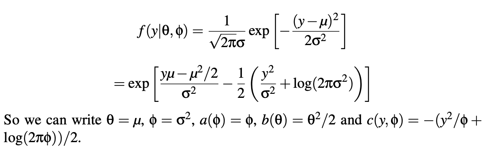
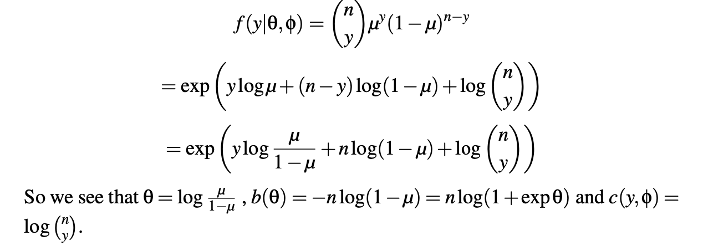
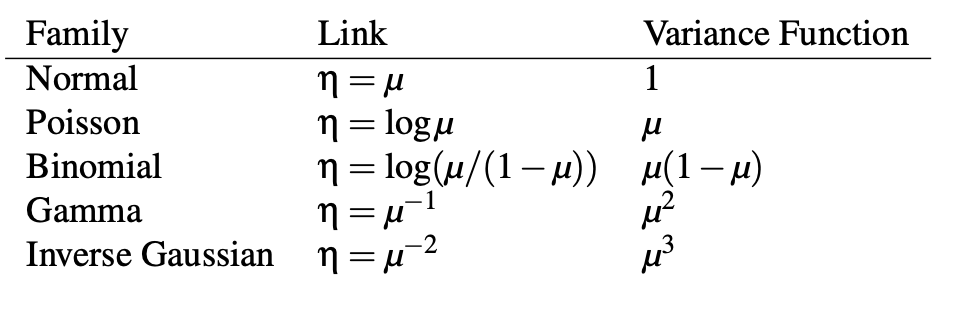

```{r setup, include=FALSE}
knitr::opts_chunk$set(echo = FALSE)
knitr::opts_chunk$set(fig.align = 'center')
library(faraway)
library(MASS)
library(dplyr)
library(ggplot2)
library(gridExtra)
library(printr)
library(tibble)
library(purrr)
library(broom)

theme_set(theme_minimal()) # automatically set a simpler ggplot2 theme for all graphics
```

# GLM Definition

## Setup

- We have now taken a deep look at normal (Gaussian), binomial/Bernoulli, Poisson and Multinomial data.
- We have seen that lots of the same tools work on all of them, even though they're sort of different. We have normal models, models for counts, models for proportions, etc. This is because they are part of the same frame work, glm.
- This is because they are all _generalized linear models_ which we will define today.

## GLM Definition

- Two components

1. The response distribution is part of and should be a member of the exponential family distribution
2. The link function describes how the _mean_ of the response, how the central parameter of the response varies according to predictors. Aka is related to the predictors. And that link function depends on the distribution as we know.

## Exponential Family

- The idea is the exponential family is any distribution that can be written in this way. So the distribution is a function of two parameters, theta and phi. It follows the equation below
- The whole thing is exponentiated. and over here we have y time theta - a functions of theta, divided by a function of phi, plus another function of y and phi. Y is our response. If a family falls into this it’s in the exponential family.

$$
f(y| \theta, \phi) = exp\left[ \frac{y\theta - b(\theta)}{a(\phi)} + c(y, \phi)     \right]
$$

- $\theta$ is the canonical parameter and is related to location
- $\phi$ is dispersion parameter and represents the scale

## Poisson

- The distribution for Poisson is defined below in the first equation.
- What we're then going to do it a bunch of algebra and see where it takes us. First of all we're going to take the exponent out of everything. We take out the exponent in the numerator. 
- That means we wrap the whole equation in a log. Because the whole thing is in a logarithm, we can actually break out the log. we can say the log of e to the negative mu + log of mu to the y - log of y factorial. 
- We can then do a little bit of simplification. Log of e to the negative mu is just negative mu. We can take out the y exponent and put it in front of the log. And the factorial we can just keep as is.  

$$
\begin{aligned}
f(y|\theta, \phi) & = \frac{e^{-u}\mu^y}{y!} \\
& = exp(\textrm{log}(e^{-u}) + \log(\mu^y) - \textrm{log}\, y!\\
& = exp(- \mu + y\,\textrm{log}\,\mu - \textrm{log}\,y!)\\
& = exp(y\,\textrm{log}\,\mu - \mu - \textrm{log}\,y!)
\end{aligned}
$$

- What we can see is now in this form, we are actually in the required form of the exponential family. In the definition equation, we have y times theta. In this equation, we have a y and we have a theta if we define theta as log(u). 
- Next in the def equation we have minus b(theta). So we have the mu parameter over here. So how can we deal with the fact that theta is log(u), well to get it to mu we just exponentiate it. So now, b(theta) is just exp(theta), and that in this case equals mu. Because we're exponentiating the log(mu) which equals mu. 
- Then with the a(phi), we're going to cheat a little bit and say that a(phi) is equal to 1. There's nothing to stop us from doing that. It shouldn’t be a surprise here because the Poisson distribution does not have a dispersion parameter built into it. So what we do is we create this degenerate a(phi)=1, because when you divide this mu theta by 1, it’s just the numerator. 
- Lastly, with the c(y, phi), since we don’t really care about phi it doesn’t have to have a function of phi. The phi can be in there but it’s a constant so it doesn’t matter. So we’re going to say that it equals -log(y!) 
- And suddenly we have shown that the Poisson is a part of this exponential family. With a lot of sort of tricks, but nevertheless that's the strategy you can employ to show that a distribution is a part of the exponential family.

- So there are no constraints at all on the functions a, b, and c. The main constraint that you have for all of this is that is does need to be a probability distribution. All these stuff needs to work together to basically integrate to 1 over all y's. So a(phi) can never be zero. It can be negative, because exponentiating makes everything positive.

- $\theta = log(\mu)$
- $\phi = 1$
- $a(\phi) = 1$
- $b(\theta) = \textrm{exp}(\theta) = \mu$
- $c(y, \phi) = -\textrm{log} \, y!$

## Normal/Gaussian

- Here is the normal distribution and it is then rewritten in a way where you can sort of see how everything comes together. and it lists out all the different parameters. 
- So when we rewrite it in the second equation, for our ytheta we have ymu. So theta is just mu. 
- For the next part b(theta), we know that theta is mu so its mu^2/2. 
- The entire bottom here is a(phi), so we say is phi simga^2 and a(phi) is just phi.  
- And the last bit c(y,phi), and that’s all this stuff on the right. All you have to make sure is that everything that's left over can’t have a mu anywhere here. You can do whatever you want with the y and the phi, which in this case phi is simga^2. But you got to have a y. You just can’t have mu in here.

```{r, out.width="100%"}

```

## Binomial

- You could do the same thing with the binomial, you can again rewrite the binomial so it fits the exponential family equation.

```{r, out.width = "100%"}

```

## Derive Properties of Exponential Distribution

- Because of that, we can now work with the general for of the exponential distributions and we can deserve different aspects of it, for example the expected value and the variance. And once we do it for the family of exponential distributions, we can now apply it to everything else

Log-likelihood
-It’s very easy to write it because the whole thing is wrapped in an exponent so all you have to do is drop that exponent. 

$$
l(\theta) = (y\theta - b(\theta))/ a(\phi) + c(y,\phi)
$$

Taking derivative
- In terms of theta. Taking it in terms of theta allows you to drop this first theta and the intercept term.

- The reason why we do this is because it’s very easy to solve for the derivative being equal to zero. However, if you have a degenerative sample or you've overfit your model, what will happen is this derivative will be zero for a bunch of different numbers. The problem is the algorithm will try to find a place where the derivative isn’t zero as it's varying the parameters and it’s just not going to be able to do that. 
- Part of the gradient descendent, it's actually looking at the derivative of this derivative to understand how to move the parameters to get you closer to zero. The derivative of zero is still just zero and so I think that’s where it gets all messed up. 

$$
l'(\theta) = (y - b'(\theta))/a(\phi)
$$

Take expectation over Y
- you can take the expectation of the derivative of the log-likelihood over y. When the log-likelihood is at its maximum, we expect this derivative to be zero. 

$$
E\,l'(\theta) = (EY - b'(\theta))/a(\phi) = 0
$$

- And suddenly you get this idea that mu is just the derivative of theta, in terms of theta or b(theta). So then you can figure out what the expected value of the response is just because you know b and yu can take the derivate of it.
- The expectation is just a function of the scale parameter here, theta.

$$
EY = \mu = b'(\theta)
$$

- And you can do a similar thing for variance. See book for derivation of variance (function of both location and scale parameter): you can derive it in the same way as you do for the general family.
- One thing that is interesting is that variance is a function of the mean and of the dispersion parameter. 
- Compared to expectation, the variance is a function of in general, it all depends. For example the Poisson a(phi) is 1, so the variance is just a function of b. 
- So you can see how that plays out there

$$
var Y = b''(\theta) a(\phi)
$$

## Link Functions

g is any link function

$$
\eta = g(\mu)
$$

- the canonical link has g such that:

$$
\eta = g(\mu) = \theta
$$
$$
g(b'(\theta)) = \theta
$$

- Because mu is defined as b'(theta), what we really want is g(b'(theta)) to equal theta. And canonical is just like a special term for this function. And it’s just so happens that it's often the one that makes the most amount of sense.

- One of the fun tricks is when you can think of link functions, the canonical link is defined as the inverse of the derivate of(theta) which is b'(theta).

## Canonical Links

- Basically what you see is that often the canonical link is the one that we use. So for the normal function, our link function is just the identity. For the Poisson, it’s the log of mu. And for the binomial, it's the log of mu - 1/mu, which is the log of the odds. 

```{r, out.width = "100%"}

```

## See reading for deviance

- You can see how all of the other things like deviance and all these other properties are very simple to define once you do it on this general exponential family. And that's one of the reasons why we are able to apply it to such a wide variety of different distributions is because they really are sort of special cases of this very generic distribution. 


